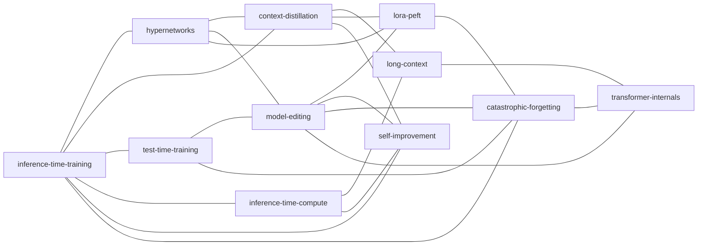

# Known — public knowledge base

> Curated, categorized knowledge. Each subfolder is one **category**, named after the category itself.
> This index maintains the **nearness graph** between categories.
> Each category's own README maintains its **containment** relations (parent / sub-topics).

Distinct from [`docs/matrix/knowledge-sources.md`](../docs/matrix/knowledge-sources.md):
- `knowledge-sources.md` = chronological intake log of every source we've actually used (the "knowledge mother nest").
- `known/<cat>/` = curated, paradigm-level knowledge about a topic. Long-lived, structural.

A reference can live in both: it appears in `knowledge-sources.md` once with a stable `[id]`, and is cited from any `known/<cat>/README.md` that contains it.

---

## Categories

| Category | One-liner |
|---|---|
| [`inference-time-training/`](inference-time-training/) | Updating model weights at inference, via backprop or hypernet. Our central topic. |
| [`hypernetworks/`](hypernetworks/) | Neural networks whose output is the parameters of another neural network. |
| [`context-distillation/`](context-distillation/) | Distilling in-context behavior into the model's own weights (teacher = same model w/ context; student = same model w/o context). |
| [`test-time-training/`](test-time-training/) | Per-instance backprop at test time, classically via self-supervised auxiliary loss. |
| [`model-editing/`](model-editing/) | Surgical weight updates to insert / remove / change specific knowledge. |
| [`lora-peft/`](lora-peft/) | Parameter-efficient adaptation via low-rank or small-prefix weight deltas. |
| [`inference-time-compute/`](inference-time-compute/) | Scaling test-time *compute* along the X-axis (CoT, sampling, search). Sibling to inference-time-training (W-axis). |
| [`long-context/`](long-context/) | Architectures, benchmarks, and limits of using long input sequences directly. |
| [`self-improvement/`](self-improvement/) | Loops where the model generates its own training signal (STaR family, Self-Refine, Reflexion, DPO, Self-Rewarding). Bridges X-axis sampling and W-axis updates. |
| [`catastrophic-forgetting/`](catastrophic-forgetting/) | Preserving prior ability while fine-tuning on a new domain (regularization, selective/sparse update, subspace-constrained, replay, MoE-specific). The write-side of plan 09. |
| [`transformer-internals/`](transformer-internals/) | Architecture-universal intrinsic phenomena — attention sinks, massive activations, super experts, induction/retrieval heads. The load-bearing sites; read-side substrate of plan 09. |

---

## Nearness graph

How close any two categories are, semantically and methodologically. *"X is near Y"* means: ideas in X often flow into Y, papers cite across the boundary, or they're competing solutions to the same problem.



### Per-category nearest neighbors (adjacency list)

The first few entries per category are the primary neighbors; ordering is rough by closeness.

| Category | Nearest |
|---|---|
| `inference-time-training` | `hypernetworks` · `context-distillation` · `test-time-training` · `inference-time-compute` · `self-improvement` · `catastrophic-forgetting` |
| `hypernetworks` | `inference-time-training` · `context-distillation` · `lora-peft` · `model-editing` |
| `context-distillation` | `inference-time-training` · `hypernetworks` · `long-context` · `lora-peft` · `self-improvement` |
| `test-time-training` | `inference-time-training` · `model-editing` · `catastrophic-forgetting` |
| `model-editing` | `hypernetworks` · `lora-peft` · `test-time-training` · `self-improvement` · `catastrophic-forgetting` · `transformer-internals` |
| `lora-peft` | `hypernetworks` · `model-editing` · `context-distillation` · `catastrophic-forgetting` |
| `inference-time-compute` | `inference-time-training` · `long-context` · `self-improvement` |
| `long-context` | `context-distillation` · `inference-time-compute` · `transformer-internals` |
| `self-improvement` | `inference-time-compute` · `inference-time-training` · `model-editing` · `context-distillation` |
| `catastrophic-forgetting` | `transformer-internals` · `lora-peft` · `model-editing` · `inference-time-training` · `test-time-training` |
| `transformer-internals` | `long-context` · `catastrophic-forgetting` · `model-editing` |

### How to read the graph

- An **edge** means "ideas cross this boundary regularly." Sometimes the categories are siblings (different solutions to the same problem); sometimes one contains methods that have generalized into the other.
- The graph is **undirected**: nearness is symmetric.
- Containment (parent / sub-topic) is **directed** and lives inside each category's own README, *not* here.

---

## Maintenance

Full policy: [`docs/maintenance.md`](../docs/maintenance.md). Local rules for this knowledge base:

- **This file is T1** — read every session. Soft cap **200 lines**, hard cap **300 lines**.
- **Each `known/<cat>/README.md` is T2** — read on demand. Soft cap **120 lines**, hard cap **200 lines**. If a category's README exceeds the hard cap, **factor**: convert `<cat>.md`'s body into `<cat>/{concepts,references,debates}.md`, keep README as nav-only.
- **One source of truth**:
  - Citations live in [`../docs/matrix/knowledge-sources.md`](../docs/matrix/knowledge-sources.md) with stable `[id]`s. Category READMEs reference by `[id]`, *not* duplicate the bibliographic data.
  - Containment (parent / sub-topic) lives inside each category README, *not* here.
  - Nearness lives **only** here (graph + adjacency list).
- **Dormant category**: if a category has not been touched in 12 months and has no inbound link from active work → `git mv known/<cat>/ known/_archive/<cat>/`; remove from the Categories table; drop its node from the graph; update neighbors' rows.
- **New category** (full checklist below). Be conservative: only add a category when ≥ 3 distinct sources / concepts are accumulating that don't fit existing categories.

### Adding a new category

1. Create `known/<slug>/` and `known/<slug>/README.md` following the per-category template (see any existing folder).
2. In its README, fill in: definition, **Contained by** (parents), **Contains** (sub-topics), key concepts, foundational references.
3. Add a row to the **Categories** table above.
4. Add the new node + edges to the **Nearness graph** Mermaid block.
5. Update the **Per-category nearest neighbors** adjacency list — bilateral (the new node's neighbors *and* the neighbors' own row).
6. If the new category is a *parent* of an existing one (e.g., adding `meta-learning` as parent of `hypernetworks`), update the existing category's `Contained by` field.

### Updating an existing category

- Adding content (papers, concepts) → edit the category's own README. No need to touch this top-level file.
- Adding / removing a neighbor → edit *both* this file (graph + adjacency list) and the relevant category READMEs' "Nearest neighbors" sections.
- Renaming → use `git mv` so history is preserved; update all references.

### Per-category README structure

Each `known/<cat>/README.md` must contain at minimum:

```markdown
# <Category title>

> One-paragraph definition.

## Structure
**Contained by**: parent categories (or "(top-level)" if none yet in this repo)
**Contains**: sub-topics, listed with one-line descriptions

## Nearest neighbors
See [the main graph](../README.md#nearness-graph). Closest:
- [`neighbor`](../neighbor/) — short reason

## Key concepts
- **Term** — definition

## Foundational references
- [id-in-knowledge-sources] One-line annotation
- Other key works (with link, year)

## Open questions / live debates
- …
```
