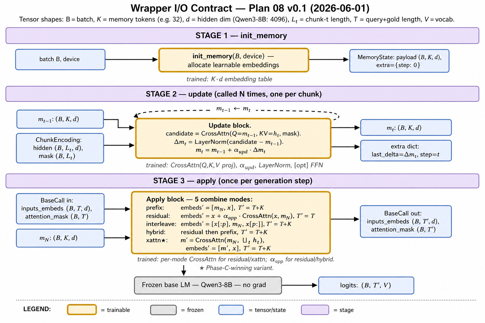
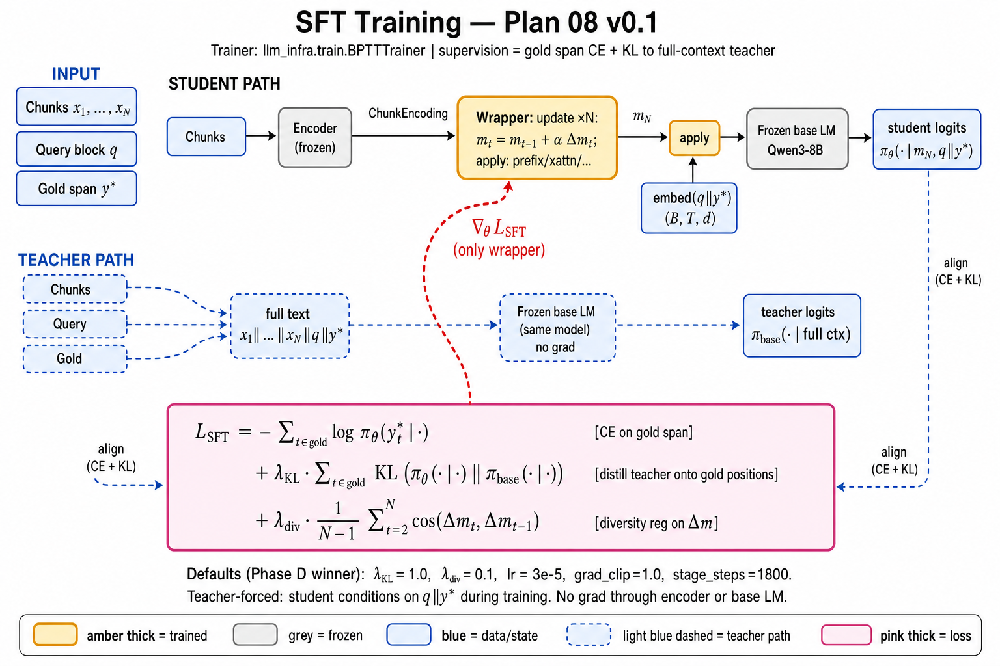
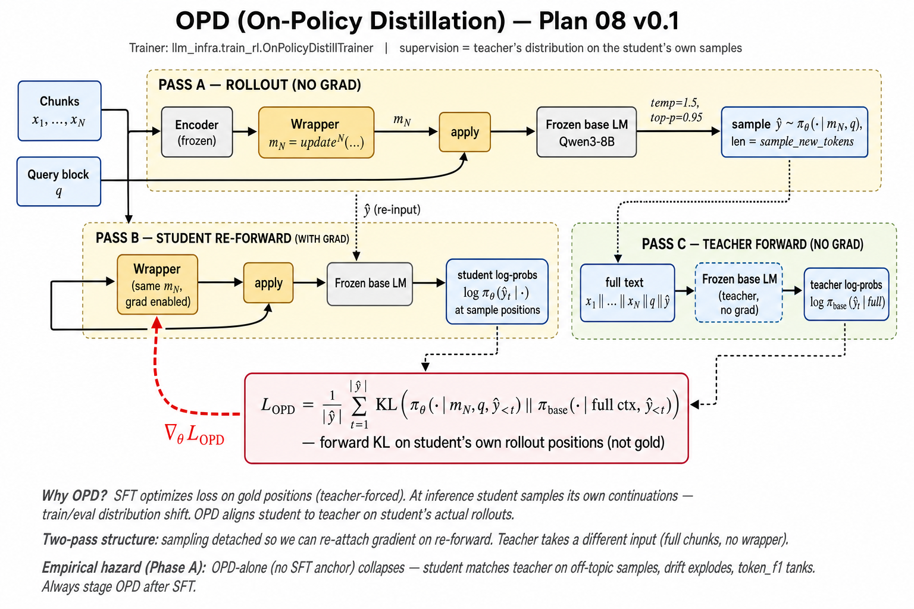
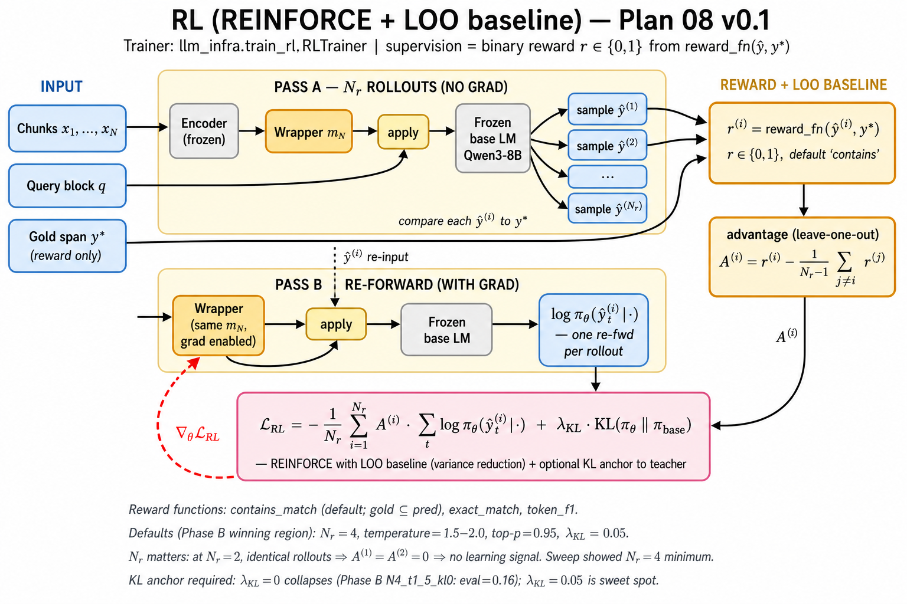

# Plan 08 — misc/

Versioned auxiliary artifacts. Bump the version whenever the
architecture, data flow, or training recipe changes in a way that would
change the diagram.

Current version: **v0.1** — 2026-06-01

Tracks code state:

| repo | commit |
|---|---|
| `llm-infra` | `a26def4` |
| `encoder-infra` | `7eca190` |
| `mem-embedding` | `e8501b4` |

## Diagrams (PNG + TikZ side by side)

| # | name | what it shows | png | tikz |
|---|---|---|---|---|
| 1 | **System overview** | full data flow, all 5 combine modes, baseline overlay, probe panels, training stages | [`architecture-v0.png`](architecture-v0.png) | [`architecture-v0.tex`](architecture-v0.tex) |
| 2 | **Wrapper I/O contract** | the 3 `Wrapper` protocol methods (`init_memory`, `update`, `apply`) with explicit tensor shapes in/out and per-mode behaviour | [`architecture-io-v0.png`](architecture-io-v0.png) | [`architecture-io-v0.tex`](architecture-io-v0.tex) |
| 3 | **SFT training** | teacher-forced loss on gold span; CE + KL-to-teacher + diversity reg; full gradient flow only to wrapper | [`training-sft-v0.png`](training-sft-v0.png) | [`training-sft-v0.tex`](training-sft-v0.tex) |
| 4 | **OPD training** | on-policy distillation: 3-pass structure (rollout / student re-fwd / teacher fwd); forward KL on student's own samples | [`training-opd-v0.png`](training-opd-v0.png) | [`training-opd-v0.tex`](training-opd-v0.tex) |
| 5 | **RL training** | REINFORCE with leave-one-out baseline; binary reward `contains_match` against gold; optional KL anchor to teacher | [`training-rl-v0.png`](training-rl-v0.png) | [`training-rl-v0.tex`](training-rl-v0.tex) |

### What each diagram answers

* **System overview** (#1) — "what does the project look like, end to end?"
* **I/O contract** (#2) — "exactly what tensors does the wrapper consume / produce at each step?" — the reference for anyone implementing a new wrapper that has to satisfy the same `Wrapper` protocol.
* **SFT** (#3) — "what does the loss look like and what aligns to what?" Student gold-span logits aligned to teacher (frozen base with full chunks visible) gold-span logits. Distance metric: CE + KL.
* **OPD** (#4) — "what supervision signal do we get when the gold span is not what the student would say?" Teacher distribution on the student's own rollouts; KL distance.
* **RL** (#5) — "what reward function and what baseline?" Binary contains-match reward, leave-one-out baseline for variance reduction, optional KL anchor to prevent policy collapse.

### Inline previews

#### 1. System overview


#### 2. Wrapper I/O contract


#### 3. SFT training


#### 4. OPD training


#### 5. RL training


## Compiling the TikZ sources

```bash
# any single file:
pdflatex training-sft-v0.tex     # → training-sft-v0.pdf

# all five at once:
for f in *.tex; do pdflatex "$f"; done

# refresh PNGs at publication resolution:
for f in *.pdf; do
  pdftoppm -r 220 "$f" "${f%.pdf}" -png
done
```

Required TikZ libraries: `positioning, fit, shapes.geometric,
arrows.meta, calc, decorations.pathreplacing, backgrounds`.

> Note: the committed PNGs are generated from a high-level description
> rather than from the TikZ source (no local TeX toolchain). They are
> visually faithful but the TikZ versions are the canonical, math-perfect
> source for paper figures.

## When to bump the version

Bump to v0.2 if any of the following changes:

* a new combine mode is added or removed
* a new training stage is added (e.g. PPO replacing REINFORCE)
* a new probe family is added or one is retired
* the recurrence equation `m_t = m_{t-1} + α·Δm_t` itself changes
* a new loss term appears (anything beyond CE + KL + λ_div / KL+LOO / KL+rew)
* the encoder is no longer the frozen base (e.g. a separately trained encoder)
* a new baseline is added that needs to appear in the comparison overlay

Bump to v1.0 when the wrapper graduates from a research prototype to a
paper-ready architecture (likely co-incident with the Phase J + 5-seed
results).

## Adding new artifacts

Keep filenames version-suffixed (`<name>-v0.<ext>`) and update the
diagram table above. PNG goes alongside the source. Do not ever
overwrite an older versioned file — make a new one and bump.
