# Long-Context Compression: Two Papers, One Fact-Base — an overview for newcomers

> ⚠️ **Terminology:** `full` in every result table = context **TRUNCATED to MAXCTX (16k)**, not the whole document (`embed(ctx[:,:MAXCTX])`). It equals *true full* only when a doc ≤ 16k — true for every bench **except ∞Bench** (131k docs → `full` sees ~12%). Only `rag` and our `auto`(chunk) read the whole doc. See [`correctness-audit-2026-07-13.md`](correctness-audit-2026-07-13.md).

> **Who this is for:** a general AI/ML researcher who has *never* seen this project. It (a) builds the background from
> scratch with links and examples, (b) summarizes everything we did since the **v2.0.0 brainstorm** and the **v1.8.0
> elegance** goals, (c) shows the figures (each titled with its **motivation / settings / conclusion**), (d) explains how
> our **two papers** are pitched, how they differ, and what facts/insights they **share** vs hold **separately**, and
> (e) links a standalone background doc on linear-attention architectures.
>
> Companion files: [`baseline-factbase-v2.0.0.md`](baseline-factbase-v2.0.0.md) (all numbers), [`baseline-diagnosis-report.md`](baseline-diagnosis-report.md) (10 failure-mode stories),
> [`insights-longcontext-validity.md`](insights-longcontext-validity.md) (when each insight holds), [`method-elegance-plan-v1.8.x.md`](method-elegance-plan-v1.8.x.md) (the method), [`v2.0.0-plan.md`](v2.0.0-plan.md).
> New this cycle: [`PAPER-A-v1.8.1-complete.md`](PAPER-A-v1.8.1-complete.md), [`PAPER-B-v2.1.0-complete.md`](PAPER-B-v2.1.0-complete.md), [`matrix-facts.md`](matrix-facts.md), [`decisions-2026-06-24.md`](decisions-2026-06-24.md), [`baseline-catalog-faithfulness.md`](baseline-catalog-faithfulness.md).

---

## 0. TL;DR
We study **how to give a language model information that doesn't fit in its context window**, and **when the ways of doing that actually work**. We ran ~**850 controlled evaluations** across ~20 KV-compression methods, the **KV-free family** (prompt compression: LLMLingua-2/orig/Long, Selective-Context; token-merging; retrieval/RAG; truncation), 7 model sizes/families, and **18 benchmarks** (retrieval NIAH variants, extractive/multi-hop/open QA, long-doc abstractive, literary MC, dialogue memory). The punchline: **every training-free baseline fails in a different, characterizable regime**, and the honest place to contribute is a **self-verified compressed memory** for the regime where they *all* fail simultaneously (long + abstractive + distractor-heavy input). This produces two papers — **Paper A**: compression **robustness via per-input validity-detection** (a do-no-harm gate on a learned soft memory); **Paper B**: **observe** long-context failures, then attach a **lightweight importance-routing structure** to a frozen base (plug-and-play or light-trained; linear + quadratic; long-prefill win). **Current state (Jul-w01):** span-level **IMP** (Paper B, training-free) already lifts long-context — retrieval = full to 16k, coherent QA rescued, and it *beats* full where compression denoises — and it **outperforms Paper A's learned compressor, which can't compress extractive QA at all** (§3.1 F/G). This tilts the project toward the Paper B line.

---

## 1. Background (concepts a general AI researcher needs)

### 1.1 Transformers, attention, and the quadratic wall
A [Transformer](https://arxiv.org/abs/1706.03762) processes a sequence by **self-attention**: every token compares itself to every other token. For a length-\(L\) input that is \(O(L^2)\) compute and memory. Doubling the input quadruples the attention cost. "Long context" (10k–1M tokens) makes this the central engineering problem.

### 1.2 The KV-cache (the thing everything below optimizes)
Language models generate **one token at a time (autoregressively)**. To generate token \(t\), attention needs the **keys (K)** and **values (V)** of all previous tokens. Recomputing them every step would be \(O(L^2)\) *again*, so we **cache** them — the **KV-cache**. It turns per-step compute from "recompute everything" into "compute one token + read the cache."

The price is **memory that grows linearly with length**. For a concrete model (Qwen3-8B: 36 layers, 8 key/value heads, head-dim 128, bf16) the cache is **144 KB per token** → **1.1 GB at 8k tokens, 18 GB at 128k, 36 GB at 256k** (model weights are a fixed ~16 GB). Two phases matter:
- **Prefill** (reading the prompt): \(O(L^2)\) compute; the attention matrix is the memory hog.
- **Decode** (generating): \(O(L)\) per step, bottlenecked by **repeatedly reading the whole KV-cache** from memory.

So the KV-cache **trades linearly-growing memory for avoiding quadratic recompute** — and that trade is the root of every long-context method.

### 1.3 The four "walls" of long context
1. **Position wall** — a model only saw positions up to its training length; going beyond needs extrapolation ([RoPE](https://arxiv.org/abs/2104.09864) → [YaRN](https://arxiv.org/abs/2309.00071) → [LongRoPE](https://arxiv.org/abs/2402.13753)). *Largely solved; YaRN is standard.*
2. **Memory wall** — the KV-cache (§1.2) gets too big.
3. **Compute wall** — prefill \(O(L^2)\) latency explodes.
4. **Usability wall** — even if it fits, the model may not *use* it (["lost in the middle"](https://arxiv.org/abs/2307.03172); context-rot). This is the subtle one and drives the modern field.

### 1.4 The five research mainlines (what people actually do)
| thread | idea | representative work | wall it attacks |
|---|---|---|---|
| Position extrapolation | stretch the position encoding | RoPE, [YaRN](https://arxiv.org/abs/2309.00071), LongRoPE, [Self-Extend](https://arxiv.org/abs/2401.01325) | position |
| **Linear attention / SSM / hybrid** | replace \(O(L^2)\) attention + unbounded KV with a **fixed-size recurrent state** | [Mamba](https://arxiv.org/abs/2312.00752), [Gated DeltaNet](https://arxiv.org/abs/2412.06464), [RWKV-7](https://arxiv.org/abs/2503.14456); hybrids Jamba/Samba/MiniMax | memory+compute (root) |
| **KV-cache optimization** | keep the cache, but **shrink it** (evict/quantize/share) | [StreamingLLM](https://arxiv.org/abs/2309.17453), [H2O](https://arxiv.org/abs/2306.14048), [SnapKV](https://arxiv.org/abs/2404.14469), [PyramidKV](https://arxiv.org/abs/2406.02069), [KIVI](https://arxiv.org/abs/2402.02750) | memory |
| **Context / memory compression** *(our family)* | compress the context into a few **soft tokens or a learned memory** | [Gist](https://arxiv.org/abs/2304.08467), [ICAE](https://arxiv.org/abs/2307.06945), [AutoCompressor](https://arxiv.org/abs/2305.14788), [500xCompressor](https://arxiv.org/abs/2408.03094), [Titans](https://arxiv.org/abs/2501.00663) | memory + usability |
| **Retrieval (RAG)** | don't stuff — **retrieve** the relevant piece | [RAG](https://arxiv.org/abs/2005.11401), [Self-RAG](https://arxiv.org/abs/2310.11511) | avoid the problem |
| **Evaluation** | measure *effective* context, expose "long ≠ usable" | [NIAH](https://github.com/gkamradt/LLMTest_NeedleInAHaystack), [RULER](https://arxiv.org/abs/2404.06654), [∞Bench](https://arxiv.org/abs/2402.13718), [LongBench v2](https://arxiv.org/abs/2412.15204) | usability |

### 1.5 Mini-glossary (with examples)
- **NIAH / RULER** — "Needle-in-a-Haystack": hide a fact ("the magic number is 8473") in a long filler text and ask for it. [RULER](https://arxiv.org/abs/2404.06654) makes the length controllable → our main "does length break it?" probe.
- **KV eviction** — drop the least-useful cached tokens. Methods differ in *how they score usefulness*: by attention (SnapKV/H2O), by key-norm ([Knorm](https://arxiv.org/abs/2406.11430)), by recency+sinks (StreamingLLM), by *reconstructability* ([KVzip](https://arxiv.org/abs/2505.23416)).
- **Prompt compression** — delete low-information *words* from the prompt text before the model reads it ([LLMLingua-2](https://arxiv.org/abs/2403.12968)).
- **Compression ratio** — fraction of the cache *evicted* (0.9 = keep 10%).
- **`full` / `no_ctx`** — our reference points: reading the whole input vs answering with no document (the ceiling and floor).

---

## 2. Our two papers

Both sit at the **memory-compression** thread but ask different questions. They share one fact-base (§3) and split the contributions.

### Paper A — *"A do-no-harm gate for compressed-context memory"* (v1.8.0 lineage → the elegant method)
- **One-line pitch:** *A compressed memory of the context is lossy, so instead of chasing a better compressor, learn a **gate** that trusts the cheap compressed memory only when a **self-verification signal** says it is safe — otherwise fall back to full context — so quality is **never worse** than the feasible baseline, at the compressed cost when safe.*
- **Contribution = the gate, not the compressor.** We show (Fig 3, and our ablations) that the compressor is a **commodity** (a lite Gist ≈ ours; flipping any single loss moves accuracy ±0.03). The elegant method (see `method-elegance-plan-v1.8.x.md`) is: **one frozen base plays four roles** (encode → read → self-distill → self-verify), **two training losses** (answer + reconstruct), **one gate signal** (the reconstruction score itself), **one guarantee** (conformal calibration → provable "quality ≥ baseline out-of-sample"). The key elegance: *the reconstruction objective is both the training regularizer and the inference gate — a memory that can reconstruct the evidence is one that retains it.* **⚠️ Empirical result (July-w01, confirmed):** the **reconstruction signal is not a usable gate** — indistinguishable from a random-memory control at K128, and the full high-K bracket scatters around 0 (K256@4k +0.084, K256@6k −0.093, K512@4k −0.002 → mean ≈ 0, the +0.084 was noise). Deeper cause: **M never compresses well (acc ≤0.30) at any K**. So Paper A's gate is compress-path **confidence** (AUROC ~0.61–0.69); reconstruction stays a hypothesis blocked on a **better compressor recipe**, not more K. (§3.1 D, F22, D26) **Update:** a 4-recipe compressor-fix sweep (longer / enc-LoRA / high-LR-no-KL) **failed** — M stays ≈ no_ctx on extractive QA (§3.1 G, F26); the learned compressor is the real blocker, and training-free IMP already beats it. Paper A likely needs a fundamentally different compressor (or to be folded into Paper B's line).
- **Positioning:** a **selective-prediction / calibration** paper for compressed memory — neighbors are model cascades, speculative decoding, and conformal prediction.

### Paper B — *"Observe long-context failures, then bolt a lightweight importance-routing structure onto a frozen base"* (v2.1.0 → the IMP method)
- **Two-part shape:** **(I) observe** the problems of long context (our fact-base: no universal baseline, attention-KV length-collapse, the abstractive/necessity failure corner, and — key — that *cheap signals can localize the needle*), then **(II) a model-structure design method** that **extends an existing frozen base** in one of two modes: **plug-and-play (no training)** or **light-weight training** of a tiny module (the base is never retrained).
- **One-line pitch:** *Long-context accuracy is bottlenecked by **finding the important information**; so add a lightweight **importance-routing structure** on a frozen base that **keeps the un-reconstructable needle verbatim and merges the redundant rest before the expensive read** — deployable plug-and-play or via a tiny distilled module, working on **both linear and quadratic** bases and cutting the **long-prefill** cost.*
- **Contribution = (C1) the IMP structure** (importance router + verbatim side-cache), plug-and-play or light-trained on a frozen base; **(C2) generality** (linear + quadratic; sizes/families — the failures are size/family-invariant, F11, so the fix transfers); **(C3) efficiency** (O(L) prune before the O(L²)/state read → long-prefill win; fast-reproducible checkpoint).
- **Positioning:** an **architecture / efficient-inference method** paper grounded in a long-context **observation study** — neighbors are ToMe, KVzip/FastKVzip, LLMLingua, R-MeeTo, and RULER/∞Bench/LongBench. It **does not** rely on the learned soft-memory compressor (Paper A's), so it is unaffected by that recipe's current bottleneck.

### How they differ
| | Paper A (robustness / validity-detection) | Paper B (lightweight structure on a frozen base) |
|---|---|---|
| **Headline** | compression **robustness** via per-input **validity detection** (gate); quality ≥ feasible baseline, cheaper | a lightweight **importance-routing structure** (plug-and-play or light-trained) that lifts long-context on a frozen base |
| **Hero result** | confidence-gate do-no-harm — **but the learned compressor can't compress extractive QA** (compress ≈ no_ctx, F26), so currently blocked | **span-IMP (training-free): retrieval = full incl. 16k, QA rescued (squad 0.15→0.46), beats full on trivia/categorical** (F24/F25, Fig 13) |
| **Evaluation** | headroom benches + gate F1/coverage/risk | RULER length-sweep + task matrix + KV-free family + cross-arch/size (generality) |
| **What's new** | self-verification / validity detection for a compressed memory | the **observe→structure** method: importance router + verbatim side-cache, base-frozen |
| **Depends on the learned compressor?** | **yes** (a soft memory to gate) — blocked on the recipe | **no** — works off the base's own signals / a tiny module |

### What they SHARE (common facts & insights)
1. **The compressor is a commodity** — no single compression knob is load-bearing; the value is elsewhere (the gate for A, the necessity+transfer story for B).
2. **No single training-free baseline is universally good** (Fig 3, Fig 6, Fig 7) — the ranking flips by length and task; this motivates *both* "add a gate" (A) and "own the regime where all fail" (B).
3. **"Full context" is not a safe default** (Fig 4) — it can underperform no-context on hard MC; both papers use this to argue you need *something smarter than stuffing*.
4. **The base is a Gated-DeltaNet hybrid with no KV-cache** — for both papers this makes KV-eviction methods N/A and a learned compressed memory the natural interface.

### What is DISTINCT to each
- **Paper A only:** validity-detection / self-verification for a compressed memory; conformal coverage guarantee; the gate F1/precision/recall machinery; the "gated ≥ full was tautological in-sample → fixed out-of-sample" correction.
- **Paper B only:** the **observe→structure** contribution — the cheap importance-signal study (F20) → an **importance-routing structure** (router + verbatim side-cache) that plugs onto a **frozen** base (plug-and-play or light-trained); the **linear-arm** side-cache/R-MeeTo; the long-prefill/efficiency win; cross-architecture generality. Does **not** need a learned soft-memory.

---

## 2.5 Current insights (the distilled takeaways)

The 27 facts (§3, [`matrix-facts.md`](matrix-facts.md) F1–F27) collapse into **six insights**; full derivation + per-cluster fact IDs in [`facts-and-insights-summary.md`](facts-and-insights-summary.md).

1. **The bottleneck is *finding/keeping the important info*, not raw capacity.** No fixed compressor is right everywhere — the winner flips by regime (retrieval / multi-hop / abstractive / literary-MC), at every model size & family (F3, F11, F18, F27).
2. **Each baseline's failure is *structural* and predictable** — it maps to a built-in assumption: attention-KV eviction has a ~16k cliff (F1); window = locality (F5); RAG = lexical overlap (F9); ToMe = mergeability, and merging destroys the needle (F14/F17); kvzip is retrieval-only (F4); LLMLingua denoises but drops needles (F8/F16).
3. **More context is often a *liability*, and compression *denoises*.** On literary-MC the full context is *worse* than answering blind, as a base-capability ceiling not a distractor effect (F6/F7); on the hardest MC (LongBench-v2) full ≈ blind (~0 gain); and compression/retrieval *beats* full on ∞Bench, squad, trivia, categorical/coding NIAH (F23, F27).
4. **The failures are architecture-, size-, and family-invariant** — including cache-free linear/GDN models where KV-eviction can't even apply (F10, F11, F15). ⇒ an importance signal transfers across bases → "bolt IMP onto *any* frozen base."
5. **Cheap O(L) signals locate the important tokens, length-invariantly** (query-relevance 0.95, surprisal 0.84; neither wins both) ⇒ a **training-free multi-signal router is feasible** (F20).
6. **Select coherent *spans*, not tokens.** Token-level top-p is retrieval-only and shreds QA; **span-level IMP-v2.1.0** keeps the needle's span (retrieval = full: RULER-16k 96.8 vs full 99.0, where ToMe→0/window→6) *and* the answer sentence (QA rescued), and *beats* full where it denoises (F24, F25, F27). — Meanwhile **Paper A's learned soft-memory compressor is blocked** (can't compress extractive QA, F26) and the reconstruction gate is a non-effect (F22), so **training-free IMP already beats the learned memory** → the project tilts to Paper B.

**Update (2026-07-09, F31/F32):** two decisive checks landed. (i) The diagnosis is **model-invariant** — all three signatures reproduce across **10 models** (1.7B→14B, Qwen2.5/3/3.5, GLM-4, Ministral, quadratic + linear-GDN), so it is a property of frozen-LLM+long-context, not a single-model artifact. (ii) **IMP's QA gap to RAG is structural** — a signal×span ablation (15 configs) closes none of it (squad ≤24 vs RAG 71). ⇒ the **robust contribution is the diagnosis fact-base**; IMP is a training-free reference point that wins only on retrieval + cache-free-linear, and is **dominated by free RAG on real QA** (F30). Honest positioning: sell the diagnosis + (pending) query-agnostic/efficiency, **not** SOTA QA accuracy. See [`dive-in-imp-weakness-and-baselines.md`](dive-in-imp-weakness-and-baselines.md).

**One line:** *long-context accuracy is a **keep-the-right-span** problem; cheap signals find that span on any frozen base (and on cache-free linear models) — but a free retrieval baseline already does the QA job better, so the durable contribution is the **diagnosis**, not the router.*

---

## 3. The empirical fact-base (figures)

Each figure's title states its **motivation, settings, and conclusion**. All on public benchmarks; training-free unless noted.

**Fig 1 — KV eviction vs context length.** Attention-based methods collapse ≥16k; attention-free (knorm/kvzip) hold to 32k.
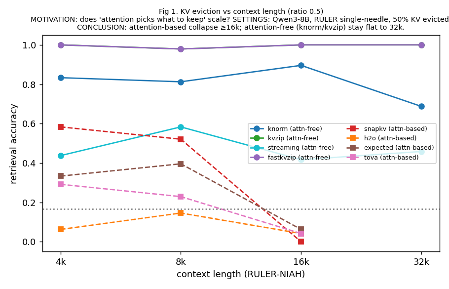

**Fig 2 — Compression-ratio cliff.** Every method cliffs; kvzip's is latest (~0.9) but real.
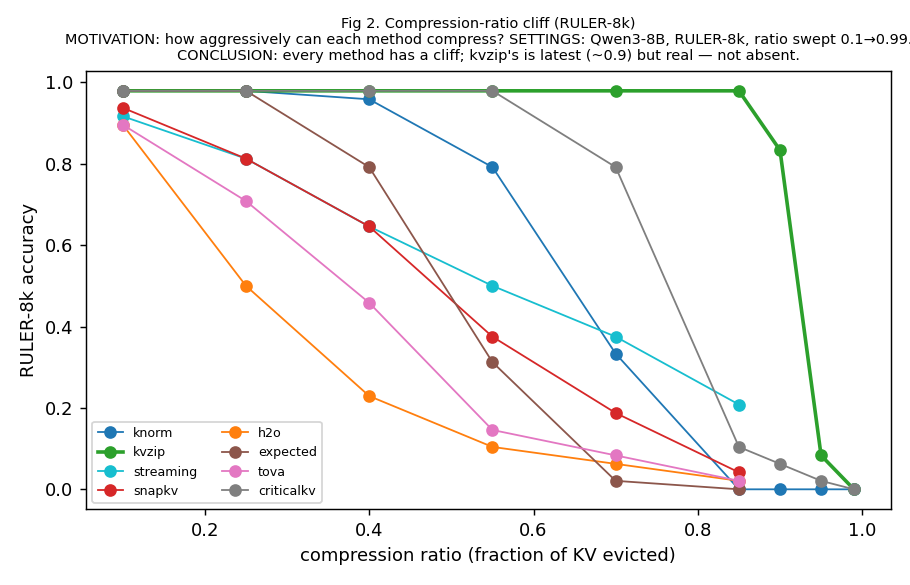

**Fig 3 — Method × task (the ranking flips).** knorm wins retrieval / loses QA; attention-based reverse. No universal winner.
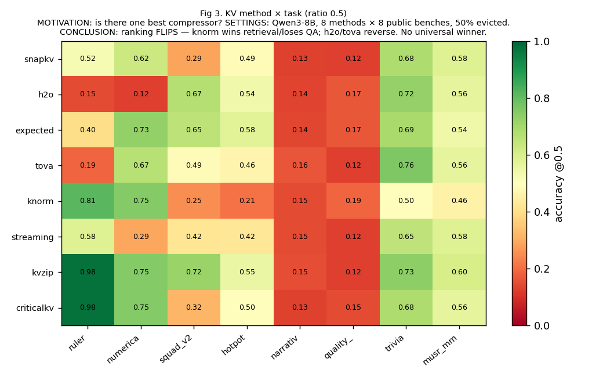

**Fig 4 — Distractors, causal sweep.** Distractors sink windowing & prompt-compression; full-read & RAG resist. "Full hurts" is task-specific, not distractor-driven.
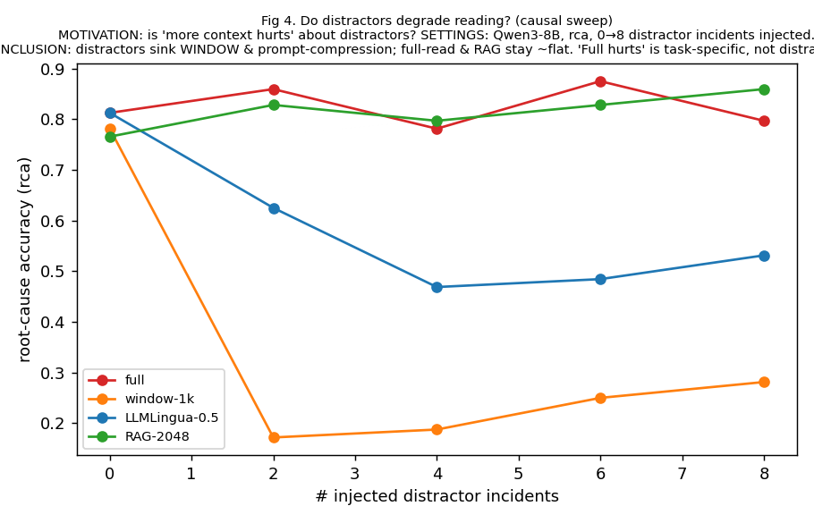

**Fig 5 — Retrieve vs stuff (RAG vs full).** RAG wins on lexical/extractive, ≈no-ctx on abstractive (narrativeqa), *hurts* on QuALITY.
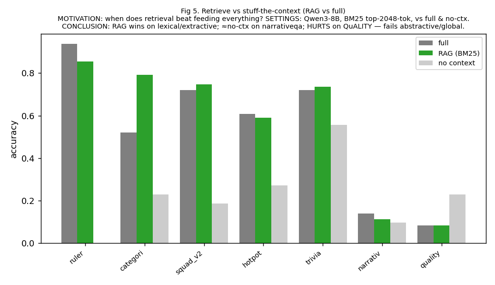

**Fig 6 — Does the failure mode scale with model size?** The collapse is **size-invariant** (1.7B→14B): it's the method, not the scale.
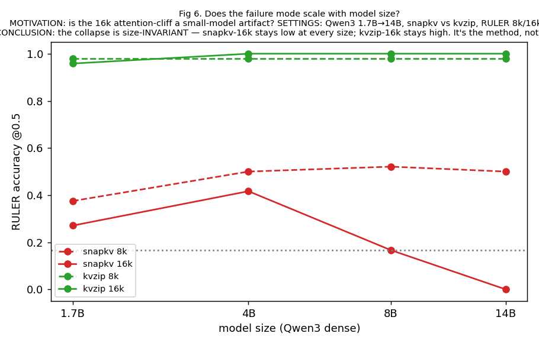

**Fig 7 — Are the failure modes universal across families?** Same pattern on Qwen3, Qwen2.5, Llama — the failures are architectural, not model-specific.
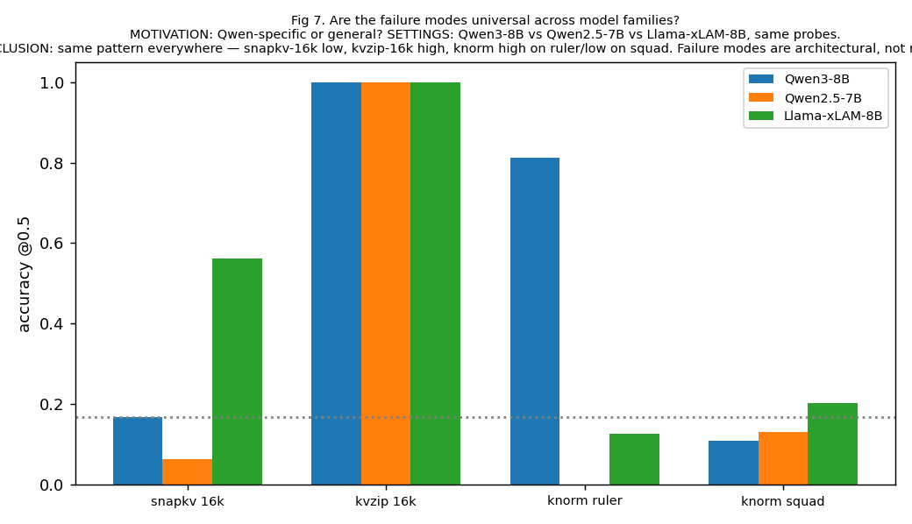

**The one-paragraph read of all seven:** compression/eviction quality is governed by *how* importance is scored (attention vs norm vs reconstruction), and each choice fails in a specific, **model- and scale-invariant** regime; retrieval wins only with lexical overlap; feeding the full context is neither safe nor always possible. The intersection where **all** baselines fail — long, abstractive/global, distractor-mixed evidence — is the necessity regime our self-verified memory targets.

---

## 3.1 New experiments (July-w01) — setting, motivation, analysis

> **Shared setting.** Base model **Qwen3-8B** (dense, has a KV cache; a second base Qwen3.5-9B GDN has none). Public benchmarks only. Multiple-choice is scored by **length-normalized log-likelihood over option letters** (`mc_loglik`, unified across harnesses this cycle); extractive/generative by substring match. Reference points in every cell: **`full`** (frozen base reads the whole input) and **`no_ctx`** (question only). "keep/budget 0.5" = retain 50% of the prompt/tokens. RULER length via filler chunks: `nc22≈4k`, `nc44≈8k`, `nc88≈16k`.

### (A) KV-free compression family — the peer set for a soft-token memory
- **Setting.** 6 KV-free methods {LLMLingua-2, LLMLingua-orig, LongLLMLingua, Selective-Context, ToMe, BM25-RAG} (+window ref) on Qwen3-8B at keep 0.5, N=48–64/cell; a 42-cell sweep over {4 task benches × 3 RULER lengths}; 39/42 landed (3 hardest cells OOM'd/timed-out: 16k perplexity-LLMLingua on the Llama-2-7b compressor, and SC×narrativeqa). Faithfulness per `baseline-catalog-faithfulness.md` (all EXACT except ToMe=input-side adapted, RAG=generic). Full tables: `baseline-factbase-v2.0.0.md §10`.

| method | mechanism | faithful? |
|---|---|---|
| **LLMLingua-2** | trained token classifier prunes prompt | EXACT (official) |
| **LLMLingua (orig)** | perplexity prune, authors' compressor LM (Llama-2-7b) | EXACT |
| **LongLLMLingua** | question-aware perplexity prune | EXACT |
| **Selective-Context** | self-information prune (authors' pkg + spaCy) | **EXACT — newly unblocked this week** |
| **Token Merging (ToMe)** | input-side bipartite soft-matching | adapted (input-side) |
| **BM25-RAG** | retrieve-then-read within a budget | generic-faithful |

- **Motivation.** KV-eviction edits a *cache*; it **does not exist on linear/GDN bases** and is not what our soft-token memory competes with. The KV-free methods reduce the **input/representation itself** — they are the true peer set for our method and the only levers that also apply to GDN. The field lacks an apples-to-apples map of *which* one works *where*.
- **Analysis.** (i) **Prompt compression is length-robust on retrieval** (0.94–1.00 across 4k–16k) — the structural *opposite* of attention-KV eviction, which collapses at 16k. (ii) **ToMe fails retrieval outright** (0.00 at every length): input-side merging destroys the needle; it only helps redundant content (squad 0.23). (iii) **RAG leads extractive** (squad 0.75 > full 0.72) but **collapses on abstractive** (narrativeqa 0.11 ≈ no_ctx). (iv) On **abstractive/literary-MC, nothing beats full**. → **F21**.

**Fig 8 — KV-free family vs context length (RULER, keep 0.5).** *Motivation:* is the length-robustness a family property? *Conclusion:* prompt compression stays 0.94–1.0 to 16k; ToMe is flat at 0 (needle merged away).
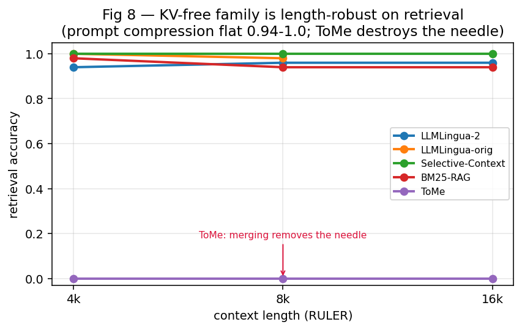

**Fig 9 — KV-free family by task (nc8, keep 0.5).** *Motivation:* which KV-free method to use per task. *Conclusion:* RAG leads extractive; nothing beats `full` on abstractive; on QuALITY every method sits near `no_ctx` because `full` itself hurts.
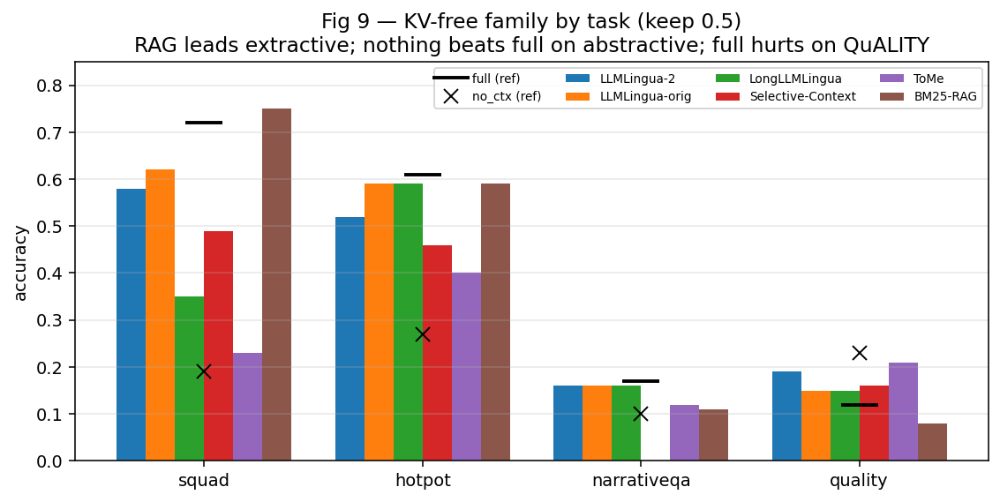

### (B) Head-to-head "which method actually works" (16k, keep 0.5)
- **Setting.** One table, all method *families* (KV + KV-free) × 5 benches {RULER, numerical-NIAH, hotpot, narrativeqa, QuALITY}, loglik-MC scoring, at a single hard operating point (16k, 50%).
- **Motivation.** Every paper reports a win on its favorite bench; we need one controlled "who wins where" to justify that *no fixed compressor is universal*.
- **Analysis.** Regime-specific: **retrieval** → kvzip/knorm/RAG/LLMLingua work (0.8–1.0), **SnapKV collapses (0.17), ToMe zero (0.00)**; **abstractive** → *nothing* works (all ≈ full ≈ 0.14); **literary-MC** → **full *hurts* (0.08)**, compression ≈ no_ctx > full. → **F18**.

**Fig 10 — Head-to-head "which works" (16k, 50% budget).** *Motivation:* one apples-to-apples map instead of per-paper cherry-picks. *Conclusion:* the green/red blocks show the win is regime-specific and no method spans all columns; the abstractive column is red for everyone.
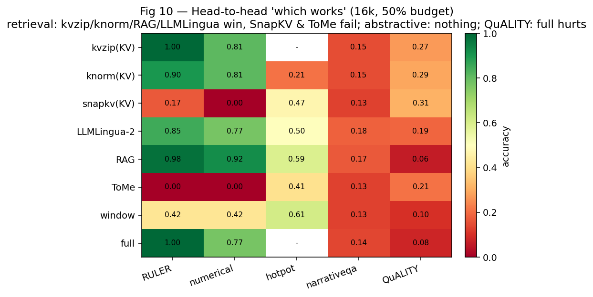

### (C) Cheap importance-signal probe (does an O(L) signal find the needle?)
- **Setting.** `run_probe.py` on NIAH benches; per-token signals {query-relevance = token·mean-query, surprisal, embed-norm, hidden-norm} scored by **AUROC of ranking the gold needle token above filler**; at 8k and 16k.
- **Motivation.** If a cheap, attention-free signal localizes the needle, a **training-free importance router** (keep the needle, merge the rest) is feasible — the seed of Paper B's method.
- **Analysis.** **Query-relevance AUROC 0.95** (word needle), **surprisal 0.84** (numeric needle), **neither wins both**, norm-signals ≤0.34, and **length-invariant** (8k≈16k). ⇒ a learned *combination* of cheap signals is the right router input. → **F20**.

**Fig 11 — Cheap importance signals: needle-AUROC.** *Motivation:* is a training-free importance router feasible? *Conclusion:* query-relevance and surprisal each exceed chance strongly but on *different* needle types → combine them; norm signals are useless.
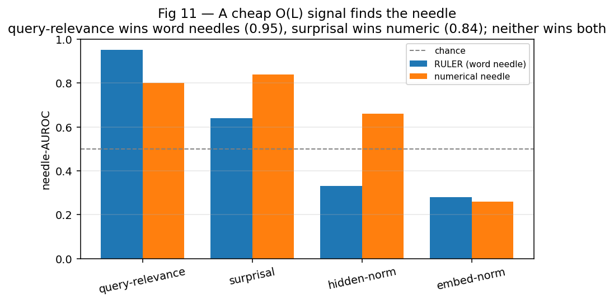

### (D) kvzip-style repeat-prompt reconstruction for the gate (Paper A) — a NEGATIVE result, with a leak control
- **Setting.** Added `recon_repeat`: prompt the frozen base to *repeat the context from the soft memory M alone* (one teacher-forced forward), giving a reconstruction loss `L_repeat` (trains M as a sufficient statistic) and a per-token NLL `r_t` (= reconstruction-importance w.r.t. M). Evaluated as a **do-no-harm gate signal** vs. compress-correctness. Ablation: 15 cells (loss-component add-one-in; λ∈{0,0.1,0.25,0.5,0.75,1,2}; prompt {default/word/empty/generic}; cond {M0/Mq}; K∈{64,128,256}) at K128/2000-step, **each with a random-M control** (recompute `r_t` with a Gaussian M matched to M's stats). A **high-K decisive re-test** (K256@4k/6k, K512@4k, train to convergence) is **running now**.
- **Motivation.** Paper A's thesis is *a memory that can reconstruct the evidence is one that retains it* — so reconstruction fidelity could be both a training regularizer and the do-no-harm gate. The ablation + random-M control exist to make sure any benefit is **not a trick** (e.g., a teacher-forcing/context-intrinsic artifact).
- **Analysis (honest — CONFIRMED negative).** At **K128/2000-step** the repeat-recon gate AUROC is **indistinguishable from its random-M control** across *all 15 cells* (the earlier single-run "+6 pt" was noise). The **complete high-K bracket confirms it**: the +repeat `real−random` deltas are **K256@4k +0.084, K256@6k −0.093, K512@4k −0.002** → **scatter around 0 (mean ≈ 0); the lone +0.084 was noise.** **Confound also holds:** at *every* K the compressed accuracy never exceeds ~0.30 (vs full 0.44) — **M never compresses well**, so the reconstruction signal can't be memory-specific. **Verdict:** repeat-recon is **not a usable gate**; the real bottleneck is the **compressor training recipe, not K**. `conf` (~0.61–0.69) remains the only reliable gate. → **F22**, [`decisions-2026-06-24.md`](decisions-2026-06-24.md) D24–D26.

**Fig 12 — Repeat-recon vs the random-M leak control.** *Motivation:* is the reconstruction gate real or a context-intrinsic trick? *Conclusion:* K128 real-M overlaps random-M at chance; the full high-K bracket (K256@4k/6k, K512@4k) **scatters around 0** — no memory-specific signal at any budget. Reconstruction is not a usable gate; confidence is.
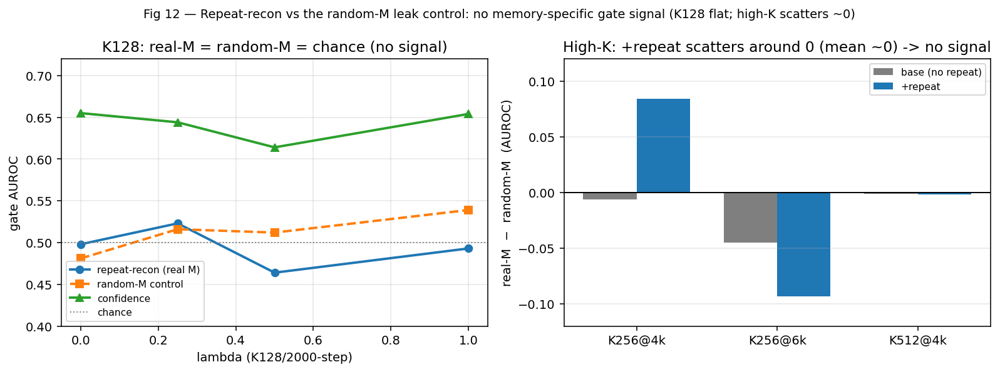

### (E) Expanded benchmark suite (6 new benches) + collapse/validity audit
- **Setting.** Added **trivia_qa, ms_marco, musr_mm, locomo, coding_niah, categorical_niah** across the KV-free family (keep 0.5, N=48); plus a **collapse audit** over all 784 baseline cells checking that `full` is a sane ceiling (fact-base §10–§11).
- **Motivation.** Broaden beyond squad/hotpot/narrativeqa/quality/RULER; and guarantee no result is a *scoring collapse* (a bench where even `full` is at the floor) — especially the abstractive cases.
- **Analysis.** On retrieval NIAH variants and lexical QA, **compression/RAG beat `full`** (denoising: coding_niah LLMLingua 0.94 > full 0.75; trivia 0.76 > 0.72). `locomo`/`ms_marco` are genuine **low-ceiling** (full 0.20/0.26). **Validity audit:** the only true collapses are old bad-config `*_niah` cells and `multi_needle_niah` (excluded); **narrativeqa is NOT a collapse** — the base emits real answers that rouge-vs-short-reference + a case-sensitive fallback under-score (uniform across methods → relative comparison fair). → **F23**, fact-base §10–§11.

### (F) IMP — Paper B's method: span-level importance routing (the headline positive)
- **Setting.** Training-free prefilter on a **frozen** Qwen3-8B: score each ctx token by `z(query-relevance)+z(surprisal)` (F20), **keep the top-p most-important spans verbatim**, drop/merge the rest; base reads the short sequence. Ablations: token- vs span-level; keep ∈ {0.25, 0.5, 0.75}; span ∈ {16, 32, 64}; 11 benches. (`imp_*`/`spf_*`/`spk*`/`sp16_*`/`sp64_*`, N=48.)
- **Motivation (straight from the observations).** No universal baseline (F18); naive merge kills the needle (ToMe 0.00, F14); but cheap O(L) signals localize it (F20). So: keep the needle's *span*, shed redundancy — no training, any architecture.
- **Analysis.**
  - **Token-level = retrieval-only:** ruler 1.0 at every length, but squad 0.15 (< no_ctx) — per-token selection *shatters the answer sentence*.
  - **Span-level = the general method:** retrieval stays ≈ full (ruler **0.96–0.98 incl. 16k**), **QA rescued** (squad 0.15→**0.46**, hotpot 0.21→**0.42**), and it **beats `full` on trivia (0.75 > 0.72) and categorical (0.98 > 0.88)** by denoising. narrativeqa stays at the floor (its ceiling is 0.17, F18).
  - **Keep-rate is monotone** (squad 0.33 / 0.46 / 0.59 at keep 0.25 / 0.5 / 0.75) — a clean budget–accuracy curve; **span size (16–64) is insensitive** (0.40–0.53). → **F24 / F25**.

**Fig 13 — IMP: token vs span (left) + keep-rate budget curve (right).** *Conclusion:* span-level importance routing keeps retrieval at full, rescues coherent QA that token-level shreds, and beats full where compression denoises; accuracy rises monotonically with the keep budget.
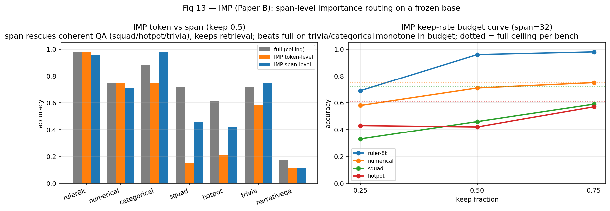

### (G) Paper A blocker (NEGATIVE): the learned compressor can't compress extractive QA
- **Setting.** 4 training recipes on squad (K256) aimed at making the learned soft-memory M actually compress: `base` (3k steps) · `long` (6k) · `enc-LoRA` (train the encoder) · `high-LR / no-KL`. (`cr_*`.)
- **Analysis.** All four land **compress ≈ 0.13–0.20 ≈ no_ctx (0.17) ≪ full (0.69)** — M carries almost no usable information; longer / enc-LoRA / higher-LR make it *worse*, so the bottleneck is **deeper than K, steps, or LR**. This is *why* Paper A's reconstruction gate was doomed (§3.1 D): a memory with ~no information has nothing to gate on. **Crucially, training-free IMP beats the learned compressor on the same task (squad 0.46 vs 0.19).** → **F26**.

---

## 4. Background on linear-attention & the KV-cache

Moved to a standalone doc (GDN full name; how many 2026 flagships are linear; linear×quadratic hybrid combos & division of labor; KV-cache vs no-cache vs linear): **[`linear-attention-and-kvcache-background.md`](linear-attention-and-kvcache-background.md)**.

---

## 5. What we did (chronology, since the v2.0.0 brainstorm)
1. **Literature review** (163 refs, main-thread judgment) → reframed the paper to **necessity + generalization** (`references-longcontext.md`, `v2.0.0-plan.md`).
2. **Baseline reproduction (faithful):** 20 KV methods (via [kvpress](https://github.com/NVIDIA/kvpress)) + LLMLingua-2 + window + RAG (BM25) + full/no-ctx, with a documented faithfulness catalog (`baseline-catalog-faithfulness.md`); dropped methods that don't run on modern GQA (PyramidKV/AdaKV/Q-Filters/DuoAttention).
3. **Fact-base sweeps** (~800 cells): master budget curve, length-sweep, task matrix, necessity length-sweep, RAG, a 10-story **diagnosis campaign**, **dive-ins** (extreme ratios, cliff localization, distractor causal, RAG-hurts), and a **scaling/cross-family expansion** (1.7B→14B; Qwen3/Qwen2.5/Llama; GDN-4B/9B).
4. **Method elegance (Paper A):** validated that pruning the compressor to a 2-loss core matches the kitchen-sink (±0.01); designed the reconstruction-as-verifier + conformal gate.
5. **Deliverables:** this overview, the fact-base, the diagnosis report, the insights-validity map, and 7 figures.
6. **July-w01 — KV-free family + new analyses (§3.1):**
   - **KV-free family** (LLMLingua-2/orig/Long, **Selective-Context newly reproduced**, ToMe, RAG): 39/42-cell sweep → prompt-compression is length-robust on retrieval, ToMe fails retrieval (**F21**, fact-base §10).
   - **Head-to-head "which works"** (F18) and the **cheap importance-signal probe** (query-relevance 0.95, F20).
   - **kvzip repeat-prompt reconstruction** for Paper A: implemented (`recon_repeat`), then a **15-cell ablation + random-M leak control** → negative at K128 (≈ random memory), but the **high-K re-test reverses it (K256@4k: +0.084 over random-M)** — underpower, not intrinsic; higher-K cells running (**F22**, D24–D25).
   - **Expanded benchmark suite** (+6 benches: trivia/ms_marco/musr/locomo/coding+categorical NIAH; **F23**, §11) and a **collapse/validity audit** over all 784 cells (confirmed `full` is a sane ceiling; narrativeqa verified genuine-but-under-scored, not a collapse).
   - Slides updated: `slides/weekly/2026-07-w01.tex`; figures Fig 8–12 added.
7. **July-w01 (cont.) — IMP method + compressor-fix attempt:**
   - **IMP (Paper B), span-level**: 23-cell sweep → retrieval = full (incl. 16k), coherent QA rescued (squad 0.15→0.46, hotpot 0.21→0.42), beats full on trivia/categorical; monotone keep-rate curve; span-size insensitive (**F24/F25**, §3.1 F, Fig 13).
   - **Compressor-fix sweep (Paper A)**: 4 recipes to make the learned M compress on squad — **all failed** (compress ≈ no_ctx; **F26**, §3.1 G). Training-free IMP (0.46) beats the learned compressor (0.19). Project tilts toward the Paper B line.
8. **July-08 — FULL-test paper main table (Paper B, F27; method = `IMP-v2.1.0` span-level Mode A):** added the two hardest mainstream long-context benches (**LongBench-v2** 503 MC; **∞Bench** longbook_choice_eng >100k MC) and launched a **112-cell full-test grid** (9 method cols × 16 benches; long-context headline on FULL split, short sanity N=500 disclosed) on idle GPUs — see [`main-table-fulltest.md`](main-table-fulltest.md) + [`experiment-config-and-sampling.md`](experiment-config-and-sampling.md). Live headline: **"more context hurts"** hardened (QuALITY full 7.2 < blind 17.9; **LongBench-v2 full 33.6 ≈ blind 33.4**); **selection beats full** (∞Bench RAG 64.2 > 53.7); **IMP near-lossless on RULER-16k (96.8 ≈ full 99.0)** where ToMe/window collapse.

*Provenance: `decisions-2026-06-24.md` D12–D25; ~850+ `RECIPE_EVAL` cells on the dev pods; figures auto-generated from the result logs.*
