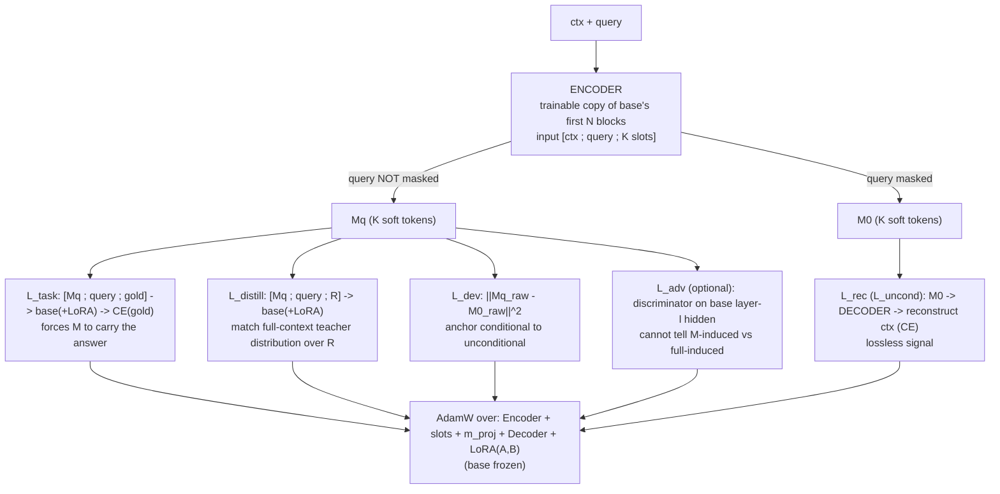
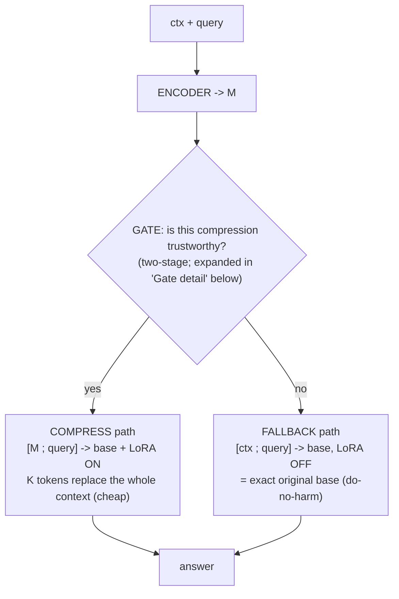
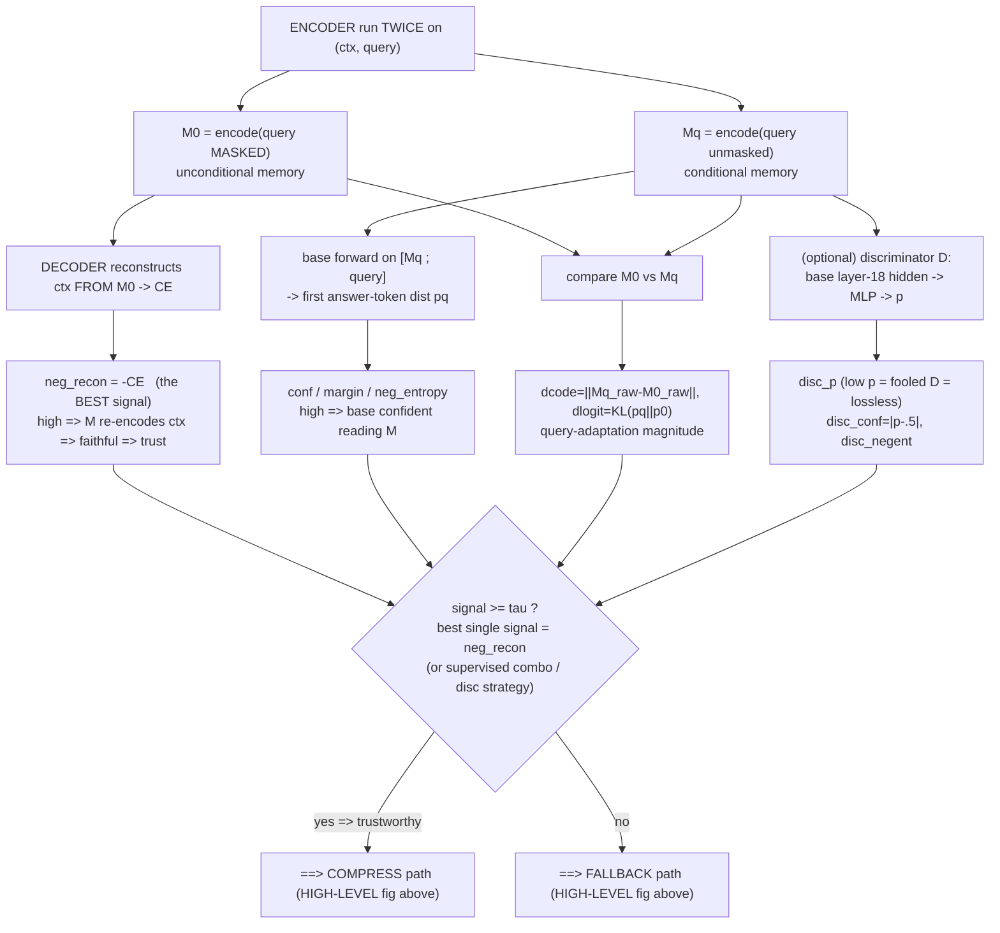

# GCM + non-merged LoRA — mechanism (v1.7.3)

Single-page, self-contained explanation of how the Gated Compressor Module (GCM) with a non-merged base LoRA
works: components, how the K memory tokens are produced, the training losses, and the compress/fallback inference
path. Clean numbers + the transfer matrix live in [`results-v1.7.3.md`](results-v1.7.3.md).

## Code map (where it lives)
Core: **`mem-test/svc/src/svc/`** · Eval/runtime: **`mem-test/mem-embedding/src/mem_embedding/gcm/`**

| file | role |
|---|---|
| `svc/compressor.py` | **Encoder** = trainable copy of base's first N blocks; **K learnable memory slots**; `m_proj`; **decoder** (reconstruction) |
| `svc/method.py` | GCM training loop, the 5 losses, gate signals `signals()`, LoRA wiring |
| `svc/lora.py` | **non-merged** LoRA on `q_proj`/`v_proj` + `set_lora_enabled` / `lora_disabled` toggle |
| `mem_embedding/gcm/runtime.py` | frozen-base runtime (`generate`, `mc_loglik`, embeddings) |
| `mem_embedding/gcm/harness.py` | eval dispatch; `_set_base_lora` (compress=on, full/fallback=off) |
| `svc/queue_lora.py`, `svc/queue_matrix.py` | winning config: `base_lora_rank=16, n_items=384, steps=1600, enc=16, K=128, n_dec=2, lam_distill=0.5` |

## How the K memory tokens are produced (NOT autoregressive)
Encoder input is `[ctx ; query ; K learnable slots]`, run through the N-layer encoder in **one forward pass**. The
final hidden states at the K slot positions → `m_proj` → **M** (K soft tokens in the base's input-embedding space).
A causal + query-mask (`compressor.py::_enc_mask`) decides what the compression "saw":
- query **masked** → **M0** (unconditional memory)
- query **unmasked** → **Mq** (conditional memory)

## Training (per item) — what is trainable
Trainable: **Encoder (N blocks) + K memory slots + `m_proj` + Decoder + base-LoRA (A,B)**. **Base weights frozen.**

**LoRA's role:** the base is frozen, but the non-merged LoRA on `q_proj`/`v_proj` lets the base *learn to read M*,
trained jointly with the encoder, and is toggled OFF on the fallback path (exact base ⇒ do-no-harm). ⚠️ **The v1.7
claim that "LoRA unlocks compression (0.35→0.53)" was a train/eval-LEAKAGE artifact** — on *unseen* items LoRA did
not help (LoRA32 0.14 < LoRA0 0.25). The clean LoRA effect is being re-measured in [`results-v1.7.3.md`](results-v1.7.3.md).

## Inference (per item) — compress vs fallback, gated [HIGH-LEVEL]

- **compress path** runs with LoRA **ON** (base reads M); **fallback path** runs with LoRA **OFF**
  (`harness.py::_set_base_lora`), recovering the **exact original base** on full context — the do-no-harm guarantee.
  `full_ctx` is scored LoRA-off too, so the "full" baseline is never contaminated.
- The single `GATE` node above hides a two-stage mechanism — **expanded next**.

## Gate detail — "is compression trustworthy?" [zoom-in of the GATE node above]
**Stage 1 — signals** (`method.py::signals`, `@torch.no_grad`): run the encoder **twice** (M0 = query-masked, Mq =
query-unmasked) and read several scalar trustworthiness signals from the memory + the base's behaviour.
**Stage 2 — decision** (`disc_gate.py::gated_acc`): threshold one signal — `compress iff signal ≥ τ`, else fall back.
The two leaves below **are the COMPRESS / FALLBACK boxes of the [HIGH-LEVEL] inference figure above**.

### The signals (oriented so higher = safer-to-compress)
| signal | source | trustworthy reading |
|---|---|---|
| **`neg_recon`** (best) | decoder CE of reconstructing ctx from M0 | high = no info lost = trust (the self-verifying core) |
| `conf` / `margin` / `neg_entropy` | base first-token dist on `[Mq;q]` | high = base sure reading M (TARG-style) |
| `dlogit` / `dcode` | KL(Mq‖M0) on first token / ‖Mq_raw−M0_raw‖ | conditional adaptation magnitude |
| `mnorm` | ‖Mq‖ | OOD / geometry check |
| `disc_p` (if adversarial-trained) | MLP on base layer-18 hidden of `[Mq;q]` | low p = M fooled D = behaviorally lossless |

### Decision + the three ways to set the gate
- **Threshold** (`disc_gate.py::gated_acc`): sweep τ; `gAcc = mean(compress-score if signal≥τ else full-score)`,
  with coverage `gcov` and realized fallback rate `1−gcov`. Deploy fixes τ at a target precision (do-no-harm
  operating point); higher τ = more conservative (compress only the very-confident items).
- **(1) intrinsic** — threshold `neg_recon` (no training; best). **(2) adversarial** — the learned discriminator p,
  strategies S_low/S_conf/S_ent/S_high (`disc_gate.py:44-57`). **(3) supervised** — 5-fold logistic regression over
  all signals (`disc_gate.py::fit_gate`).
- **Empirical**: bfcl `neg_recon` AUROC 0.88, gAcc 1.0 (held-out = in-sample ⇒ realizable). rca/squad AUROC≈0.5
  (signals can't tell) ⇒ the gate correctly **always falls back ⇒ gAcc = full** (do-no-harm). Note `gAcc` = model +
  fallback; `best(compress,full)` = oracle-gate upper bound; `always-compress` = no fallback.

## Results — see [`results-v1.7.3.md`](results-v1.7.3.md)
⚠️ The earlier "two-regime" numbers here (bfcl compress 0.531 etc.) were **inflated by train/eval leakage** and have
been removed. Clean numbers (in-task HP tuning + the in/cross-task/cross-domain transfer matrix, all tool benches)
live in **[`results-v1.7.3.md`](results-v1.7.3.md)**. What still holds structurally: the gate's job is **do-no-harm**
(fall back when compression would hurt ⇒ gАcc ≥ full), and transfer is expected weak (encoder+LoRA trained per-corpus).
