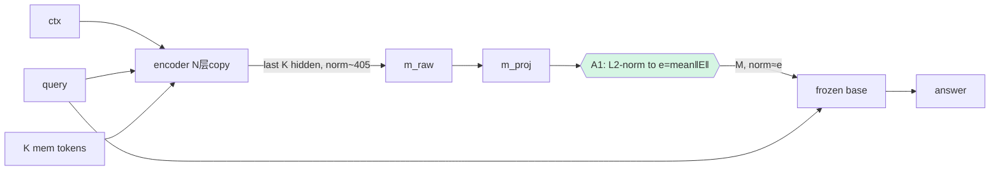

# A1 · v1.7.1.1 — M 归一化到 embedding 尺度（修 OOD）

## 动机
`m_raw` 是 encoder 过完 **final RMSNorm** 的 hidden（记录 `mnorm≈405`），`m_proj`（eye-init）不改尺度，于是注入第 0 层的 `M` 的范数远大于真实 input-embedding（OOD）→ 冻结 base 当成"怪 token"，取不出 span。**最便宜的修法**：把 `M` 的每-token 范数对齐到 base 词嵌入的范数分布。

## 详细做法
1. 训练前算一次目标尺度 `e = mean_v ||E[v]||₂`（base 词嵌入逐行 L2 范数的均值），存为 buffer。
2. `encode` 出口对投影后的 `M` 做：`M ← M / (||M||₂ + ε) · e`（逐 token L2 归一化再缩放到 `e`）。
   - **A1a**（默认）：硬缩放到 `e`。
   - **A1b**（变体）：`e` 设为**可学习标量**（init=词嵌入均范），让训练自己调。
3. 其余（encoder/decoder/损失/门）完全不变，重训。
4. 旁证：注入前打印 `||M||` vs `mean||E||`，确认对齐；并复测 `acc_compressor`。

## 流程图

## 实现位置
- `svc/compressor.py::SelfVerifyingCompressor`：`__init__` 注册 `self.register_buffer("embed_norm", mean_row_norm)`；`encode` 出口加归一化（开关 `cfg.m_norm_match`）。
- `mem_embedding/gcm/harness.py` + `methods.py::TrainCfg`：加 `--m-norm-match {off,hard,learn}`。
- 跑：`queue_v17` 增加 `q35_A1_squad / q35_A1_hotpot`（N16/K128/adv，--m-norm-match hard）。

## 结果（seed42，DONE；seed43 在 sam-dev 跑，待补 CI）
| run | comp(A1) | comp(ctrl) | Δ | no_ctx | full |
|---|---|---|---|---|---|
| Qwen3.5 squad | **0.171** | 0.146 | **+0.025** | 0.213 | 0.617 |
| Qwen3.5 hotpot | **0.095** | 0.146 | **−0.051** | 0.250 | 0.447 |
| Qwen3-8B squad | **0.153** | 0.128 | +0.025 | 0.174 | 0.669 |

## 读法（DONE）
- **A1 基本无效**：squad +0.025 / hotpot −0.05，**都在单 seed 噪声(±0.04)内**，且仍 ≪ no_ctx(0.21/0.25) ≪ full(0.62/0.45)。
- 结论：**仅对齐范数不够**——M 的方向/分布仍 OOD，且冻结 base 本就读不了软前缀。→ 升级 **A2（流形投影，连方向一起修）** 与 **A3（LoRA 让 base 学读）**，已在 queue 跑。seed43 补 CI 但趋势已定（≈null）。
