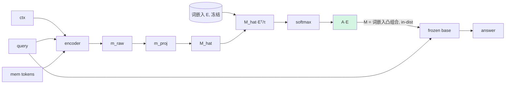

# A2 · v1.7.1.2 — M 投影到 token-embedding 流形（soft-nearest-embedding）

## 动机
A1 只对齐范数；但 `M` 的**方向**也可能在词嵌入流形之外。强约束：让每个 `M` token 成为**真实词嵌入的凸组合**，从构造上保证 in-distribution（base 只见过这种向量）。类似 "soft prompt 锚到词表"。

## 详细做法
1. `E`：base 词嵌入矩阵 (V×d)，冻结。
2. `encode` 出口：`A = softmax(M·Eᵀ / τ)`（1,K,V，温度 τ，可只在 top-m 词上算以省显存）；`M ← A·E`（1,K,d）。于是 `M` 是词嵌入的加权平均 → 必然在流形内、范数也自然对齐。
3. τ 控制"软硬"：τ→0 接近硬最近邻（离散），τ 大→平滑混合。默认 τ=1，扫 {0.5,1,2}。
4. 变体 **A2b**：top-m（如 m=512）截断的稀疏混合，省 V×K 显存。
5. 其余不变，重训。

## 流程图

## 实现位置
- `svc/compressor.py::encode`：开关 `cfg.m_manifold`（τ、top-m）；需要 base 的 `E`（`m_proj` 后接投影）。
- harness/TrainCfg：`--m-manifold-temp τ --m-manifold-topm m`（0=off）。
- 跑：`q35_A2_squad / q35_A2_hotpot`。

## 结果（PENDING）
| run | τ | comp | no_ctx | full | gAcc | gate AUROC |
|---|---|---|---|---|---|---|
| squad A2 | 1 | – | 0.213 | 0.617 | – | – |
| hotpot A2 | 1 | – | 0.250 | 0.447 | – | – |

## 读法（待填）
- 若 A2 > A1 → 不止范数，方向/流形也重要。
- 若 A2 仍不动 → OOD 不是唯一瓶颈，重心转 A3（让 base 学读）。
