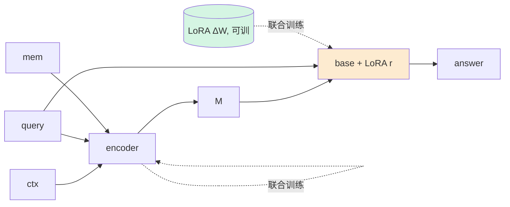

# A3 · v1.7.1.3 — base 加小 LoRA 学"读 M"（放开冻结）

## 动机
即使 `M` 范数/流形修好，**冻结 base 也从没被训练去使用软前缀**。Gist 原版正是 **LoRA 微调 base** 让它学会读 gist token。这是预期收益最高的一招（直击"读不了"根因），代价是放弃"base 全冻结"这条原则（改成"base 仅 LoRA 适配，主体冻结"）。

## 详细做法
1. 在冻结 base 的注意力/MLP 上挂 **LoRA**（rank r∈{8,16,32}，仅 q_proj/v_proj 起步，或 +o/up/down）。
2. **联合训练**：LoRA 参数 + 压缩器（encoder/mem/m_proj/decoder）一起，目标仍是 `L_task`(+L_uncond/L_dev)。base 主体仍冻结。
3. eval：base 带 LoRA，输入 `[M;query]`。`full`/`no_ctx`/baselines 也用**同一个 LoRA-base** 复测（公平 + 给出"LoRA 后的 full 天花板"）。
4. 变体 **A3b**：LoRA 只训"读 M"——`full_ctx` 仍用原冻结 base，只有 GCM 路径带 LoRA（更纯，但 full 不可比）。默认 A3a（全体同一 LoRA-base）。
5. 扫 r、目标模块、lora_lr。

## 流程图

## 实现位置
- `gcm/runtime.py`：`load_base` 后挂 LoRA（peft `get_peft_model` 或手写 LoRALinear 包 q/v_proj）；保证 train+eval 路径都生效；保存/复用同一 LoRA。
- `svc/method.py::train`：把 LoRA 参数加进 optimizer；eval 时 base 处于 LoRA-on。
- harness/TrainCfg：`--base-lora-rank r --base-lora-targets q,v --base-lora-lr`。
- 跑：`q35_A3_squad/hotpot`（含同-LoRA 的 no_ctx/full/gist/cart 复测）。

## 结果（seed42，fp32-LoRA；bf16 重跑在 sam-dev seed43 队列里）
| run | r | **comp** | no_ctx(+LoRA) | **full(+LoRA)** | vs full 无LoRA(0.617) |
|---|---|---|---|---|---|
| squad A3 r8  | 8  | **0.107** | 0.231 | **0.881** | full +0.26 |
| squad A3 r16 | 16 | **0.115** | 0.204 | **0.843** | full +0.23 |

## 读法（DONE，重要）
- **LoRA 大幅抬 full（0.617 → 0.84–0.88），却完全不抬 comp（仍 ~0.11 ≈ no_ctx）。** 即：让 base 学到的那点东西（gold-CE 喂出的"答案抽取/格式"技能）帮的是**有上下文时**的回答，而**压缩记忆 M 本身没带上答案**，所以 comp 不动。
- **结论翻转**：瓶颈**不是**"冻结 base 读不了软前缀"（A3 给了 base 适配也没救 comp）——瓶颈是 **M 压缩本身丢了 span 级信息**。A3/A4（让 base 会读）这条假设被**证伪**。
- **副产物**：我们之前 frozen-no-LoRA 的 `full=0.617` 是**被低估的天花板**；加个 rank-8 LoRA，真实 full ≈ **0.88**。压缩离它更远了。
- 公平性注记：full 与 comp 用同一 LoRA-base；comp–full 差距不但没缩小，反而更大。
