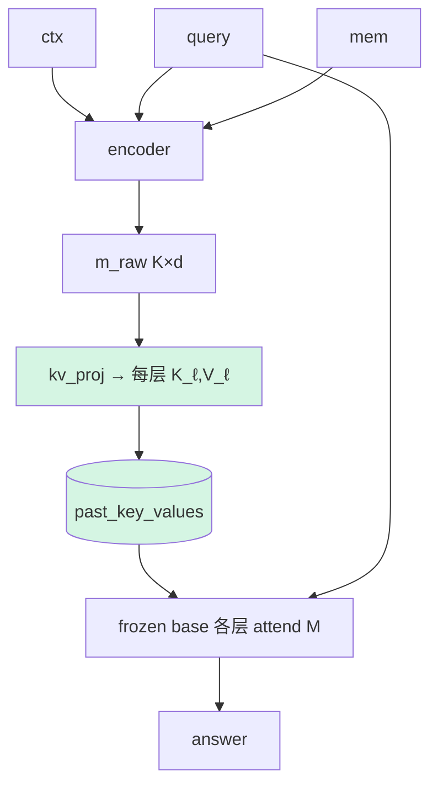

# A4 · v1.7.1.4 — KV-cache 注入（每层 K/V，而非第0层 embed）

## 动机
现在 `M` 只在 base **第 0 层**作为输入嵌入注入，信息要靠 36 层冻结网络自己往上传；而 Gist/Cartridge 原版把记忆放在**每一层的 KV-cache**——query 在**每一层**都能 attend 到记忆。这是"对的接口"，且天然绕开 input-embedding 分布约束（KV 本就是 hidden 尺度）。

## 详细做法
1. encoder 仍产出 K 个 slot 的 `m_raw`(1,K,d)。
2. 新增投影头 `kv_proj`：`m_raw → {(K_ℓ, V_ℓ)}_{ℓ=1..L}`，每层 `K_ℓ,V_ℓ ∈ (1, n_kv_heads, K, head_dim)`。
3. base 前向用 `past_key_values` 注入这组 KV（占 query 之前的"虚拟位置"），query 各层 attend 它们；position_ids 让 query 接在 K 个虚拟位后。
4. 训练目标不变（`L_task` 等），梯度回到 `kv_proj`+encoder。
5. 注意：要绕开我们为兼容性用的 cache-free 前向——A4 必须用 `past_key_values`（Qwen3/3.5 + tf5.10 已验证可用）。
6. 变体 **A4b**：只注入部分层（如前 1/2 或每隔一层）省显存/算力。

## 流程图

## 实现位置
- `svc/compressor.py`：加 `kv_proj`（Linear d→L·2·n_kv·head_dim）+ `encode_kv` 返回 DynamicCache。
- `gcm/runtime.py`：新增 `generate_kv / mc_loglik_kv` 走 `past_key_values`（position_ids 偏移 K）。
- `svc/method.py`：`prefix` 改为产出 KV；train 的 `[Mq;q;gold]` 前向改成 base(query, past_kv=M)。
- harness/TrainCfg：`--inject {prefix,kv}`、`--kv-layers all|half`。
- 跑：`q35_A4_squad/hotpot`。

## 结果（PENDING）
| run | layers | comp | no_ctx | full | gAcc | gate AUROC | FLOPs vs full |
|---|---|---|---|---|---|---|---|
| squad A4 all | all | – | 0.213 | 0.617 | – | – | – |
| hotpot A4 all | all | – | 0.250 | 0.447 | – | – | – |

## 读法（待填）
- 若 A4 ≫ A1/A2 → 注入接口（每层 KV）是关键，而非仅 OOD。
- 与 A3 对照：A4 不动 base 权重（仍冻结）就拿到每层访问；A3 动 base（LoRA）。两者可叠加（A3+A4）。
