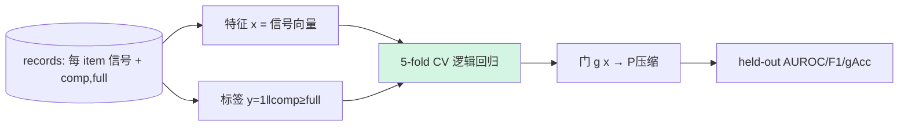

# B1 · v1.7.2.1 — 监督门（真实标签拟合，离线，0 训练成本）

## 动机
对抗判别器是被训来"被骗"的，且目标（M-induced vs full-induced 表征可分）≠ 门目标（压缩会不会掉点）。把门改成**直接监督**：用真实标签 `y = 1[comp ≥ full − ε]`，在已 log 的信号上拟合一个分类器，**带 train/val 划分**（避免现在"测试集挑最优阈值"的乐观）。可完全**离线**从现有 records 做，0 训练成本。

## 详细做法
1. 特征 `x_i` = 现有逐 item 信号向量：`[dlogit, neg_dlogit, dcode, neg_recon, conf, margin, neg_entropy, mnorm, disc_p]`（标准化）。
2. 标签 `y_i = 1[comp_i ≥ full_i − ε]`。
3. 模型：逻辑回归（+ 小 MLP 变体 B1b）。**K-fold CV**（如 5 折），报 **held-out** 的 AUROC / best-F1 / gAcc。
4. 对照：单信号最好者（现在的 disc/intrinsic）、always-full、best/oracle。
5. 看**特征权重**：哪些信号真正有用（可指导 B2）。

## 流程图

## 实现位置
- `svc/disc_gate.py`：加 `--fit logreg|mlp`，用 sklearn（`LogisticRegression` + `StratifiedKFold`）在 `signals` 上拟合；输出 held-out 指标 + 系数。纯离线、读现有 `out/q35/*/records_*.jsonl`。
- 不需重跑实验。

## 结果（DONE 2026-06-11，Qwen3.5-9B K256 in-task，5-fold CV，离线）
| run | 模型 | **held-out AUROC** | F1 | gAcc | 最佳单信号(in-sample,乐观) |
|---|---|---|---|---|---|
| squad B1 | logreg(9 信号) | **0.483** | 0.351 | 0.617 | 0.645 (disc) |
| hotpot B1 | logreg(9 信号) | **0.485** | 0.691 | 0.439 | 0.551 (neg_entropy) |

## 读法（DONE）
- **held-out AUROC ≈ 0.48 = 随机以下**：把 9 个信号组合起来、正经做 5 折 CV，**仍然预测不了"压缩会不会掉点"**。
- 之前单信号 0.645 是**在测试集上挑阈值的乐观**；真正 held-out 一评，信号没有任何泛化预测力。
- **结论：门在当前信号下不可学**（gAcc 仍 = always-full）。根因不在门设计，在**压缩本身**——压缩几乎对所有样本都均匀地亏，信号自然分不出"哪些能压"。**必须先修压缩（A 组）**；B2 富特征也只有在压缩变强后才有意义。
