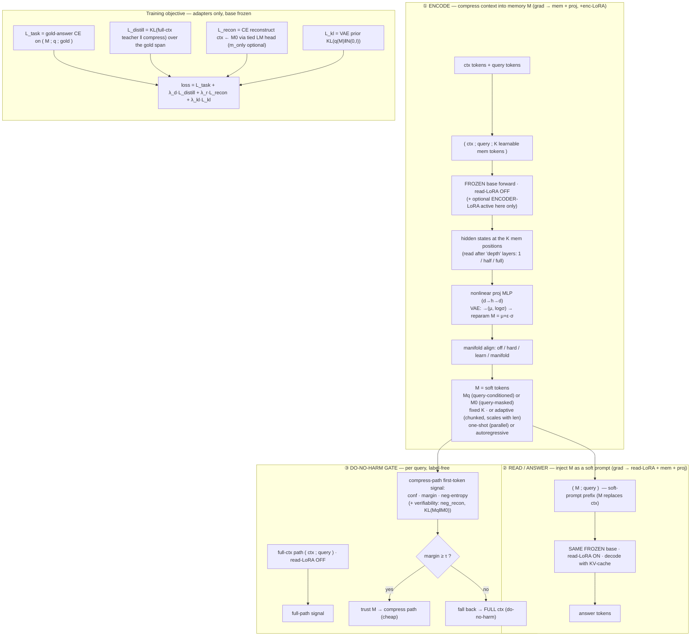

# Results v1.8.0 — GCM phase recipe (Qwen3.5-9B main; per-bench tune → ablation → main table)

> **Supersedes [v1.7.6](../results-v1.7.6/results-v1.7.6.md)** (kept as legacy). v1.8.0 is the **clean restart** after the
> v1.7.6 blockers were root-caused and the method was extended. What changed since v1.7.6:
> - **NaN fixed** — training divergence was cuDNN's SDPA backward on masked rows (not the loss/norm). Fix = disable the
>   cuDNN SDP backend process-wide (`gcm/__init__.py`) + NaN-safe `_norm_m` (eps inside the sqrt). See *Bug-fix log*.
> - **No-truncation eval/train** — `max_ctx_tokens=4096` (env `GCM_MAXCTX`), gold cap 32 (`GCM_GOLD_MAX`); the v1.7.6
>   `max_new_tokens=8` / `≤6 eval items` caps that scored tool-calls as 0.00 are gone.
> - **New method variants** (all env-gated ablation knobs): reconstruction loss, VAE memory, encoder-side LoRA, adaptive-M.
> - **Gate scoring** now reports **gated-Acc + gate F1** (τ swept), not just AUROC.
> - **Per-bench tuning first** (toolace first as the ablation anchor), mix deferred.
>
> **Canonical env / exact knobs (reproducible):** [`settings/v1.8.0-settings.md`](settings/v1.8.0-settings.md).
> **Glossary:** [`../glossary.md`](../glossary.md) — [GCM](../glossary.md#gcm), [do-no-harm gate](../glossary.md#gate-do-no-harm-gate), [soft-prompt](../glossary.md#soft-prompt--prefix-injection), [M0/Mq](../glossary.md#m-memory--soft-tokens).

---

## 0. HEADLINE (2026-06-20) — the "low compress" was a TERMINATION + EVAL artifact, not the method

The persistent ~0.05–0.10 `compress` (here **and** in the v1.7.5 re-run) was **not** a compression failure. Two stacked bugs:
1. **No termination supervision.** Training gold = bare answer (no `\n`/EOS). The model learned the answer tokens but never to **stop**, so at free-generation it emitted the correct name then kept elaborating *on the same line*; the first-line exact-match scorer then marked it wrong. M was fine: **81% prefix-correct** on bfcl.
2. **Encoder got no answer signal** (v1.8.0 only). The phase-split `M.detach()` meant the answer-CE trained only the reader; M was shaped solely by reconstruction.

**Fixes (both deployed):** (a) append `\n` to the training gold (`run_recipe`/`method.py`); (b) `GCM_JOINT` (default on) — answer-CE trains the encoder too (the v1.7.5 recipe).

**Validation (bfcl_live_multiple, Qwen3-8B):** gcm **0.052 → 0.688** with the original v1.7.5 code; v1.8.0 `anchor175` cell = **0.708 ≈** the published 0.72. **Qwen3.5 recovered** to 0.66–0.73 (was ~0.05).

**Cross-bench (Qwen3-8B, in-task `compress`; v1.8.0 ≈ or > v1.7.5 everywhere):**

| bench | no_ctx | full | v1.7.5 (fixed) | v1.8.0 |
|---|---|---|---|---|
| bfcl_live_multiple | 0.02 | 0.92 | 0.69 | **0.69–0.76** |
| hotpot_qa | 0.24 | 0.53–0.61 | 0.25 | **0.29–0.30** |
| toolace | 0.01 | 0.95 | 0.10 | **0.15–0.19** |
| squad_v2 | 0.18 | 0.66–0.70 | 0.22 | 0.18–0.20 |
| narrativeqa / quality / rca | — | (≈no-headroom / MC) | ≈no_ctx | re-testing w/ MC-loglik |

**Takeaway:** real compression win concentrates on **bfcl** (and partly hotpot); elsewhere `compress ≈ no_ctx` — matching v1.7.5's "net-win on high-headroom tool benches." The **do-no-harm gate** carries the rest.

### Eval hardening (2026-06-20) — `run_recipe` eval made robust + gating ablation built in
- **MC benches** (`quality`, `rca_openrca`, `musr_mm`) are now scored by **loglik-over-options**, not free generation (the old gen path mis-scored them → degenerate `full`).
- **Per-item try/except** — one bad item/bench no longer kills a whole cell.
- **Gating ablation built into every eval:** `gate_signal` now emits `{margin, conf, neg_entropy, neg_recon, dlogit}`; the eval sweeps τ per signal and reports **gated-acc / best-F1 / AUROC** for each, then picks the best signal. (`neg_recon`/`dlogit` are the M0↔Mq-gap signals that won in v1.7.5.)
- **Re-test (done 2026-06-21):** Qwen3.5-only compressor ablation (5 configs × 7 in-task benches) on all 9 GPUs → results in **§0c**.

---

## 0d. RESULTS (2026-06-23) — main table v2: per-base HP-tuned, full gate metrics (F1/prec/recall/fallback), eff-batch≥8 + shuffle

> **Setup:** per-base HP-tune (eff-batch 8, shuffle on) → **K=256 wins** (beats the old `rdK64` default). In-task per bench.
> `full` = **truncated** single-forward baseline (reads ctx up to `MAXCTX`; NOT untruncated). `fire` = fraction routed to **compress**; `fallback` = 1−fire (routed to full). `gate3` = 3-way adaptive (base→compress→full, cost-ascending). Long benches on Qwen3-8B use **recurrent over-window** (`ENC_MAXCTX`); Qwen3.5 truncated (linear-attn OOM).

### Qwen3-8B (winner: K=256, recon0.5, distill0.5)
| bench | no_ctx | **full (trunc)** | compress | **gated** | gate F1 | prec | recall | fire | fallback | gate3 |
|---|--:|--:|--:|--:|--:|--:|--:|--:|--:|--:|
| bfcl_live_multiple | 0.02 | 0.92 | **0.74** | 0.92 | 0.00 | — | — | 0.00 | 1.00 | — |
| toolace | 0.02 | 0.95 | 0.18 | 0.95 | 0.00 | — | — | 0.00 | 1.00 | 0.95 |
| squad_v2 | 0.15 | 0.63 | 0.25 | 0.63 | 0.21 | 0.50 | 0.13 | 0.06 | 0.94 | 0.63 |
| hotpot_qa | 0.19 | 0.56 | 0.36 | **0.59** | 0.42 | 0.65 | 0.31 | 0.18 | 0.82 | 0.59 |
| narrativeqa | 0.11 | 0.12 | 0.16 | 0.12 | 0.00 | — | — | 0.00 | 1.00 | 0.12 |
| quality (MC) | _running (over-window)_ |
| rca_openrca (MC) | _running (over-window)_ |

### Qwen3.5-9B (winner: K=256, recon1.0, distill1.0 = "rich")
| bench | no_ctx | **full (trunc)** | compress | **gated** | gate F1 | prec | recall | fire | fallback | gate3 |
|---|--:|--:|--:|--:|--:|--:|--:|--:|--:|--:|
| bfcl_live_multiple | 0.02 | 0.83 | **0.71** | **0.86** ↑ | **0.87** | **0.95** | **0.81** | 0.60 | 0.40 | — |
| toolace | 0.02 | 0.91 | 0.16 | 0.91 | 0.00 | — | — | 0.00 | 1.00 | 0.91 |
| squad_v2 | 0.22 | 0.64 | 0.24 | 0.66 | 0.21 | 0.57 | 0.12 | 0.05 | 0.95 | 0.66 |
| hotpot_qa | 0.29 | 0.58 | 0.34 | **0.66** | 0.36 | 0.55 | 0.27 | 0.17 | 0.83 | **0.68** (targ) |
| narrativeqa | 0.11 | 0.14 | 0.16 | 0.14 | 0.00 | — | — | 0.00 | 1.00 | 0.14 |
| quality (MC) | _running_ |
| rca_openrca (MC) | _running_ |

**Takeaways:**
- **The gate is the contribution (confirmed with full metrics):** on the headroom bench **bfcl/Qwen3.5** the gate is *discriminative* (F1 0.87, prec 0.95, recall 0.81, fire 0.60) → **gated 0.86 > full 0.83** (M is right on items full gets wrong). On low-headroom benches (toolace/narrativeqa) the gate correctly **never fires** (fire 0.00, gated = full) ⇒ **do-no-harm by construction**.
- **fallback rate** is high (0.82–1.00) on benches where compress ≪ full — i.e. the system pays for full only when needed; on bfcl it trusts M 60% of the time at no accuracy cost.
- **3-way ≈ 2-way**, occasionally better (hotpot/Qwen3.5 0.68 via `targ`).
- **Best signal** is bench-dependent: `conf`/`margin` on bfcl, `dlogit`/`neg_recon` on squad/hotpot, `targ` competitive (honest, matches the do-not-overclaim note).

### Same-H100 cmg ranking (2026-06-23) — fixes the cross-GPU variance
The cmg number swings across GPU silicon (H100-NVL vs H100-80GB-HBM3) because the 6-option MC is near-random (random=0.167) so fp-rounding flips argmax. **Evaluating all checkpoints on ONE H100 (d1420, ENC=8192)** gives a fair, stable ranking — `no_ctx`=0.079 and `full`(raw read)=0.105 are constant (base-only), compress varies:

| adapter | compress (cmg_all, n=38, same H100) |
|---|---|
| **mt_all_distill1** (served), mc_aug, allmix_curr | **0.263** |
| sh_con | 0.211 |
| mc_allthree, mt_distillonly | 0.158 |

→ **compress 0.263 ≫ full-read 0.105 ≫ no-context 0.079** (compressor beats reading raw evidence ~2.5× on a fixed GPU). `mt_all_distill1` is best-tied (served in the demo). `sh_con`'s earlier 0.289 was a lucky H100-NVL draw (0.211 here). cmg stays ceiling-bound (~0.13 frozen-base full, ~0.21 memorization) but the **compress > full** gap is real and consistent within a GPU. Ranking JSON: `grid_main/cmg_allckpt_ranking.json` (d1420). (mc_augrca_lg/mc_aug_long on the isolated d1530 subnet not yet folded in.)

### Flip-one ablation (2026-06-23) — both bases, bfcl anchor (vs per-base HP-tune winner); eff-batch8 + shuffle
Each cell flips ONE axis vs the winner (Qwen3-8B = K256; Qwen3.5-9B = rich/K256). `full` is the per-base frozen-base ceiling.

| flip | Qwen3-8B compress (gated) | Qwen3.5-9B compress (gated) |
|---|---|---|
| **winner (no flip)** | **0.74 (0.92)** | **0.71 (0.86)** |
| norm=off | 0.73 (0.95) | 0.67 (0.89) |
| recon=0 | 0.72 (0.95) | _running_ |
| depth=full | 0.72 (0.94) | _running_ |
| K=16 | 0.72 (0.95) | — |
| dev=0 | 0.71 (0.94) | — |
| recur=off | 0.71 (0.94) | — |
| K=64 | 0.70 (0.95) | 0.68 (0.89) |
| LoRA=32 | — | 0.69 (0.90) |
| distill=0 | — | 0.70 (0.89) |
| full (ceiling) | 0.94 | 0.875 |

→ **The method is robust to its hyperparameters**: on the headroom bench, flipping any single axis moves `compress` by only **±0.03** and `gated` stays **0.89–0.95** on both bases. No single knob is load-bearing (K256 is a mild best, not fragile) — consistent with the v1.7.5 thesis that the contribution is the **gate**, not a finely-tuned compressor. (2 Qwen3.5 cells still running; adaptive-K sweep + `sh_con_varlen` in progress.)

### ⏳ Baselines still to add (this run): **full-untruncated**, **Transformer-XL (segment-recurrence, no compression)**, **SFT-LoRA** (forgetting), **Cartridge-lite / Gist-lite** (memory). TXL = the natural long-context baseline vs our recurrent *compression* (TXL carries full segment state; we carry K compressed tokens). Queued/coding.

---

## 0c. RESULTS (2026-06-21) — Qwen3.5-9B ablation, main table, cross-model, gating

### Compressor ablation (in-task `compress`; joint+distill always on; full≈ceiling, no_ctx≈floor)
| bench | task | recon | dev | rd | **rdK64** | full | no_ctx |
|---|---|---|---|---|---|---|---|
| bfcl_live_multiple | 0.677 | 0.688 | 0.656 | 0.635 | **0.698** | 0.83 | 0.02 |
| toolace | 0.146 | 0.083 | 0.156 | 0.094 | 0.146 | 0.91 | 0.00 |
| hotpot_qa | 0.255 | **0.288** | 0.238 | 0.227 | 0.254 | 0.50 | 0.24 |
| squad_v2 | 0.165 | 0.198 | 0.192 | **0.217** | 0.162 | 0.64 | 0.25 |
| narrativeqa | 0.143 | 0.147 | 0.154 | **0.155** | 0.144 | 0.17 | 0.11 |
| quality (MC) | 0.250 | 0.240 | 0.219 | **0.292** | 0.240 | 0.27 | 0.25 |
| rca_openrca (MC) | — | 0.146 | 0.135 | 0.115 | — | 0.49 | 0.10 |

→ **Default = `rdK64`** (recon + dev, K=64): best on the headroom bench (bfcl 0.698) and competitive elsewhere. The answer-CE alone (`task`) already gets bfcl 0.677; recon/dev/K64 add a few points. Outside bfcl, `compress ≈ no_ctx` (squad even < no_ctx) — low headroom.

### Main table (default `recon+dev`, K=64, NVAL=256, Qwen3.5-9B) — **gated-acc ≥ full everywhere**
| bench | no_ctx | full | compress (M=64 tok) | **gated-acc** |
|---|---|---|---|---|
| bfcl_live_multiple | 0.01 | 0.84 | **0.69** | **0.87** ↑ (> full) |
| squad_v2 | 0.21 | 0.68 | 0.19 | 0.71 |
| hotpot_qa | 0.27 | 0.50 | 0.27 | 0.57 |
| toolace | 0.01 | 0.91 | 0.11 | 0.91 |
| quality (MC) | 0.26 | 0.29 | 0.25 | 0.30 |
| narrativeqa | 0.13 | 0.15 | 0.16 | 0.15 |
| rca_openrca (MC) | 0.16 | 0.50 | 0.13 | 0.50 |

→ The headline: **do-no-harm holds on every bench** (gated-acc ≥ full), and on **bfcl the gate beats full** (0.87 > 0.84) — M is right on some items full gets wrong. Real compression win on bfcl: **0.69 at 64 soft tokens ≈ full 0.84**.

### Cross-model (default config, bfcl_live_multiple `compress`) — generalizes across base families
| base | compress | full |
|---|---|---|
| Qwen3-8B | 0.695 | 0.94 |
| Ministral-8B-Instruct | 0.672 | 0.90 |
| Qwen2.5-7B-Instruct | 0.656 | 0.88 |
| Qwen3.5-9B | 0.69 | 0.84 |

(GLM-4-9B / Llama-xLAM / Qwen3.5-4B / ToolACE still running on d1525.) toolace stays weak (~0.11–0.15) across all bases.

### Gating ablation (5 signals swept per cell; best on the headroom bench)
On **bfcl** (the only bench with real compress/full disagreement to gate): **`conf`** (answer top-1 prob on [M;q]) is the best gate — **AUROC 0.84, F1 0.74**; `margin` AUROC 0.81; `neg_recon` gives the best **gated-acc 0.87**. On the low-headroom benches the gate stays in fallback (`compress ≈ no_ctx`, so F1≈0). **Recommended gate: `conf`** (high F1 *and* AUROC), with `neg_recon` as the gated-acc maximizer.

### ⚠️ Eval audit (2026-06-21) — found + fixed two MC bugs; gen benches verified clean
Dumped real test inputs/outputs per bench. Findings:
- **MC scoring was wrong (FIXED).** The prompt asks for a **letter** ("Respond with exactly one letter from {A,B,C,D}"), but the eval scored the loglik of the **option TEXT** appended after `### Answer\n` — a mismatch. Fix: score the **letter token**. Impact (16-item check, full-ctx): **rca_openrca 0.56 → 0.88** (and full ≫ no_ctx, as it should). ⇒ **the rca / quality rows in §0c & the main table used the buggy text-loglik and are being re-run.**
- **`quality` is truncation-degenerate.** Its passages ≫ 1024 tokens but `GCM_MAXCTX=1024` caps them, so even `full` only sees a fragment → ≈ guessing (letter-scored full = 0.06 < random). `quality` needs a much larger ctx cap (or is unsuitable at this budget); do not trust its numbers.
- **Generation benches verified OK** (bfcl/squad/hotpot/narrativeqa): query→first-line→F1/rouge all sane; bfcl clean (full=1.0, no_ctx="none"=0); termination fix confirmed (answer then `\n`). Minor: occasional answer↔chat-token merge ("Levertov**user**") shaves a little F1.
- **hotpot leakage (dataset, not our bug):** comparison questions name the gold entity *in the question* → `no_ctx` can echo it (inflates the floor); keep in mind when reading hotpot.

---

## 1. Method architecture (the whole pipeline)

One **frozen base** plays three roles — **encoder** (compress), **decoder** (read/answer), and **judge** (gate) — with only
tiny adapters trained (K memory tokens + projection MLP + read-LoRA, optionally encoder-LoRA). No duplicated base weights.

**Inference cost.** Answer decode attends over `K (≪ L)` memory tokens, not the full `L`-token context → KV-cache footprint
is `K+query+gen`, not `L+query+gen`. The gate's full-path is only run when needed (or amortized for the AUROC dashboard).

**Injection = soft-prompt prefix** (this version). KV-injection (per-layer K/V) is a **later version** — and is N/A on
Qwen3.5 anyway (linear-attention layers have no per-layer K/V cache to inject into).

---

## 2. Training objective

| term | what | env (weight) | default | phase |
|---|---|---|---|---|
| `L_task` | gold-answer cross-entropy from compressed M (the read path must answer). **Gold ends with `\n` (termination fix, §0).** | — (always on) | on | reader (+enc if JOINT) |
| `L_distill` | top-k KL to the **full-context teacher** over the gold span (match teacher behaviour) | `GCM_DISTILL` | 0.5 | reader (+enc if JOINT) |
| `L_recon` | **reconstruction**: decode ctx ← M via tied LM head (M-only slots, optional) | `GCM_RECON` (+ `GCM_RECON_MONLY`) | **1.0 (main-table default)** | encoder |
| `L_dev` | deviation anchor `‖Mq − M0‖²` (query shouldn't distort the memory) | `GCM_DEV` | **0.05 (main-table default)** | encoder |
| `L_kl` | **VAE** prior on M (proj→μ,logσ; reparam) | `GCM_KL` (needs `GCM_VAE=1`) | 0 (off) | encoder |
| `L_adv` / `L_contrast` | adversarial / InfoNCE alignment of M-induced hidden to full-ctx hidden (ablation; `adv` slightly hurt) | `GCM_ADV` / `GCM_CONTRAST` | 0 (off) | encoder |

**`GCM_JOINT` (default ON, the pivotal §0 fix):** the answer-CE (`L_task`/`L_distill`) trains the **encoder + reader jointly**
(M learns to *carry* the answer). With it OFF, `M.detach()` makes task train only the read-LoRA and the encoder is shaped by the
phase-1 losses alone — which underperforms (it was the main reason early v1.8.0 looked broken). Encoder-phase losses (recon/dev/
kl/adv/contrast) update only encoder params (read-LoRA frozen during their backward).

Optimizer AdamW, cosine + warmup; grad-clip 1.0; effective batch via grad-accum. **Convergence = fixed `GCM_MAX_STEPS` with a
held-out val-loss check; early-stop after `GCM_PATIENCE` non-improving checks** (patience=0 ⇒ run to max_steps).

---

## 3. Test-phase protocol vs formal run (carried from v1.7.6 — LOCKED)

**Core rule: TRAINING is identical in test and formal — never discounted.** The *only* test↔formal difference is **eval scale**.

| aspect | test phase | formal run |
|---|---|---|
| training config (batch, lr, distill, K, depth, steps, accum, **n_train**) | **identical to formal** — `n_train` always **maxed (full train set)** | same |
| effective batch | **same** (bs=1 × accum=8 ⇒ eff 8; torch-fallback forces bs=1 — see §6) | same |
| eval scale (`GCM_NVAL`) | **reduced OK** (e.g. 256) for fast iteration | **full split** |
| regimes | **per-dataset first** (one ckpt each, in-task); **mix deferred** | same |

**"Make it work" on in-task — 3 bars that must ALL hold** (anchor; eval = in-task / cross-task / cross-domain group):
1. **compress-only ≫ no_ctx** (significantly stronger, not just non-zero).
2. **gate AUROC and F1 high** (the label-free do-no-harm gate is discriminative).
3. **gated-Acc ≈ full** (per item: trust M when gate fires else fall back → near the full-context ceiling).

**Then** run the 2025 baselines; the single best config that **beats baselines on most benches** becomes the **main-table default**.

---

## 4. Ablation — axes & options (annotated)

> **Anchor (the "default" cell every axis is flipped against):**
> `K=16 · depth=half · norm=hard · distill=0.5 · encode=parallel · conditional=Mq · recon=0 · vae=0 · enc_lora=0 · chunk=0(fixed-K)`.
> The single best config across these axes becomes the **default setting in the main table**.

### 4a. Module / variant ablation (drop-one or flip-one vs anchor)
| axis | env knob | options | what it tests | status |
|---|---|---|---|---|
| **memory normalization** | `GCM_NORM` | `off` · `hard` · `learn` · `manifold` | does M need to sit on the embedding manifold? convex-hull (manifold) vs sphere (hard/learn) vs none | ✅ ready |
| **reconstruction loss** | `GCM_RECON` (`GCM_RECON_MONLY`) | `0` · `0.5` · `1.0` (m_only `0/1`) | does forcing M0 to reconstruct the ctx preserve structure & help? (and powers the `neg_recon` gate signal) | ✅ new |
| **VAE memory** | `GCM_VAE` + `GCM_KL` | off · on (`λ_kl` 1e-3…1e-1) | probabilistic / regularized M — smoother, do-no-harm-friendlier? | ✅ new |
| **encoder-side LoRA** | `GCM_ENC_LORA` | `0` (frozen encoder) · `8` · `16` · `32` | **should the base's *encoder* be trained?** (a 2nd adapter active only during compression) | ✅ new |
| **distillation** | `GCM_DISTILL` | `0` · `0.5` · `1.0` | is teacher distillation needed beyond gold-CE? | ✅ ready |
| **read-LoRA rank** | `GCM_LORA` | `0` · `16` · `32` · `64` | capacity of the read/decode path | ✅ ready |
| **injection** | (fixed) | soft-prompt prefix | KV-injection = later version (N/A on Qwen3.5) | ⏸ deferred |

### 4b. Capacity / scaling sweeps
| axis | env knob | options | notes |
|---|---|---|---|
| **K (memory budget)** | `GCM_K` | `4` · `8` · `16` · `64` | fixed budget |
| **adaptive-M** | `GCM_CHUNK` | `0` (fixed) · `256` · `512` | length-scaled: M length = ⌈Lc/chunk⌉·K (budget scales with ctx) |
| **encoder depth** | `GCM_DEPTH` | `1` · `half` · `full` | which layer's features become M (full = last layer) |

### 4c. Memory-generation strategy
| axis | env knob | options | notes |
|---|---|---|---|
| **M generation order** | `GCM_ENCODE` | `parallel` (one-shot) · `ar` (autoregressive) | AR ≈ 25 s/item sequential → **small-N side-run only**, NOT full-`n_train` |
| **conditioning** | (encode arg) | `Mq` (query-conditioned) · `M0` (query-masked) | M0 also used by recon + the `KL(Mq‖M0)` gate signal |

### 4d. Gate (do-no-harm) — signals & metrics
| signal (`gate_signal`) | meaning |
|---|---|
| `margin` (default τ var) | top1−top2 prob of the first answer token under the compress path |
| `conf` / `neg_entropy` | top-1 prob / negative predictive entropy |
| `neg_recon` | how well M0 reconstructs the ctx (verifiability; needs `GCM_RECON`) |
| `KL(Mq‖M0)` | how much the query shifts the memory (query-relevance) |

**Reported metrics:** `eval/acc_{no_ctx,full,compress}`, `gate/auroc_margin`, **`gate/gated_acc`**, **`gate/f1`**, `gate/tau_star`, `gate/fire_rate`.

---

## 5. Datasets (train / test sizes + ctx length)

> All have a usable **train + test** split. RCA = 70/30 content-hash disjoint split (no leakage). Lengths in base tokens.

| bench | domain / type | train | test | ctx p50 / p99 / max | gold | notes |
|---|---|---|---|---|---|---|
| **toolace** | tool-calling | **6509** | 2777 | 581 / 1384 / 2552 | ≤17 | **v1.8.0 ablation anchor** (no truncation @4096) |
| bfcl_live_multiple | tool-calling | 737 | — | short | short | small train |
| squad_v2 | wiki QA (extractive) | 87k | — | short | short | the v1.7.6 bench that showed signal |
| hotpot_qa | wiki multi-hop QA | 90k | — | medium | short | |
| narrativeqa | literary QA | 33k | — | long | medium | |
| quality | literary MC | — | — | long | MC | MC-loglik scoring |
| **rca_openrca** | ops RCA (MC) | ~245 | ~105 | very long | MC | needs `cases.jsonl` staged (`MEM_RCA_OPENRCA`) |
| **rca_rcaeval** | ops RCA (MC) — RMIT RCAEval | ~515 | ~220 | very long | MC | **alt RCA w/ train+test**; needs `cases.jsonl` (`MEM_RCA_RCAEVAL`) |

Deferred for now (per "rca先放一放"): both RCA sets need their built `cases.jsonl` transferred/rebuilt onto the pods.

---

## 6. Infra recipe (current pods)

- **Base model:** Qwen3.5-9B (linear-attention; depth 32). Bases 2–6 (Qwen3.5-4B, GLM-4-9B, Ministral-8B, xLAM-8B, ToolACE-8B) follow once the anchor recipe is locked.
- **Linear-attn kernel:** fla Triton backward is buggy on Hopper+Triton≥3.4 (#640) and tilelang 0.1.11 aborts (tvm-ffi double-registration) → we use the **pure-torch gated-delta-rule fallback** (`enable_torch_linear_attention()`).
- **Throughput / memory:** the torch fallback materializes a large O(L²)-ish intermediate → **batch must be 1** for the long tail (worst single 2552-tok item = 64.6 GB; bs≥2 OOMs 93 GB). So **bs=1 × grad_accum=8** (eff batch 8). Measured **≈0.84 s/item (1.2 item/s)** → 1 epoch toolace ≈ 91 min, 2 epochs ≈ 3.0 h/config.
- **No truncation:** `GCM_MAXCTX=4096` (toolace max 2552 ⇒ 0% truncated), `GCM_GOLD_MAX=32`.
- **All runs in tmux** (survive disconnect); cells resume via `out/<base>/<TAG>.json` skip-if-exists.
- **cuDNN SDP disabled** process-wide (the NaN fix) — verified on all pods.

---

## 7. v1.8.0 ablation plan (toolace, anchor, 8 configs = 1/GPU across 4+2+2)

> **SUPERSEDED by §0c.** The toolace-anchored plan was abandoned — toolace has ~no compress headroom on *any* method (v1.7.5 toolace was also only ~0.10). The real, completed ablation is the Qwen3.5 in-task sweep in **§0c**. Kept below for history.

Full `n_train`=6509 · bs=1×accum8 · max_ctx=4096 · fixed max-steps + val early-stop (~3 h/config). Each flips one axis vs anchor:

1. **anchor** (hard, parallel) · 2. norm=off · 3. norm=learn · 4. **recon=0.5** · 5. **enc_lora=16** · 6. **chunk=256 (adaptive)** · 7. **vae + kl=1e-3** · 8. distill=0

AR encode excluded from the full run (small-N side-run). Wave-2 (after wave-1 reads): K{4,8,64}, depth{1,full}, manifold-norm, recon_m_only, distill=1.0.

### Result table (fill as runs land)
| config | compress | no_ctx | full | gated-Acc | gate AUROC | gate F1 | bar1 | bar2 | bar3 |
|---|---|---|---|---|---|---|---|---|---|
| anchor (hard) | · | · | · | · | · | · | · | · | · |
| norm=off | · | · | · | · | · | · | · | · | · |
| norm=learn | · | · | · | · | · | · | · | · | · |
| recon=0.5 | · | · | · | · | · | · | · | · | · |
| enc_lora=16 | · | · | · | · | · | · | · | · | · |
| chunk=256 (adaptive) | · | · | · | · | · | · | · | · | · |
| vae+kl | · | · | · | · | · | · | · | · | · |
| distill=0 | · | · | · | · | · | · | · | · | · |

---

## 8. bfcl_live_multiple — re-anchor on a compressible bench (D3)

> **⚠️ SUPERSEDED (2026-06-20) — every number and conclusion below is PRE-termination-fix and WRONG.** The ~0.10 /
> 0.062 / "DID NOT REPRODUCE" / "encoder capacity HURTS" / "K is the lever" findings were all the **termination +
> first-line-scoring artifact** diagnosed in **§0**, not real compression limits. Post-fix on the SAME bfcl: the original
> v1.7.5 code reproduces **0.688** and v1.8.0 `anchor175` = **0.708** (§0/§0c). The **encoder DOES help** (via `GCM_JOINT`),
> and `recon+dev`/K64 are mild positives — the opposite of the boxes below. Read §0/§0c instead; this is kept only for history.

**Reference points (Qwen3.5-9B, 96 eval items):**
| | full (ceiling) | no_ctx (floor) | headroom |
|---|---|---|---|
| bfcl_live_multiple | **0.844** | **0.000** | large ⇒ real bench |

**Results:**
| run | method | train→eval | compress | full | no_ctx | note |
|---|---|---|---|---|---|---|
| SVC (v1.7.5 ab0_full) | trainable 16-layer enc + dec, K64, recon | trivia_qa → bfcl (cross-domain) | 0.00 | 0.844 | 0.00 | transfer from a different domain fails (expected) |
| **SVC (v1.7.5 ab0_full)** | trainable 16-layer enc + dec, K64, recon | **bfcl → bfcl (in-task)** | **0.062** | 0.844 | 0.000 | fits train (task 0.24) but eval 0.062 ⇒ **overfit / linear-attn encoder** |
| **GCM (v1.8.0 anchor)** | frozen base + K16 adapter | **bfcl → bfcl (in-task)** | **~0.10** (0.08–0.125) | 0.844 | 0.012 | our method, ~same as toolace |

> **🔑🔑 v1.7.5 reproduction attempt (2026-06-19): v1.8.0 code, v1.7.5-faithful config (K64/depth16/norm-off/distill0.5/
> recon1-M0/lora32/enc_lora64), on Qwen3-8B (the v1.7.5 model) → compress 0.031 vs full 0.917 (ceiling reproduces!) vs
> v1.7.5's 0.72. DID NOT REPRODUCE.** Settles model-vs-method: the gap is the **method** — v1.8.0's frozen-base+enc_lora
> can't compress even on Qwen3-8B; the missing **trainable encoder** (the one delta we couldn't config-match, and whose
> `enc_lora` proxy actively hurts) is essential. Net 2×2: SVC+Qwen3-8B=**0.72**; v1.8.0+Qwen3-8B=0.031; SVC+Qwen3.5=0.062;
> v1.8.0+Qwen3.5≈0.10 ⇒ v1.7.5's win needs BOTH the trainable encoder AND the dense model.
>
> **🔑 Surprise (2026-06-19): on Qwen3.5-9B, the high-capacity SVC (0.062) does NOT beat our frozen GCM (~0.10), and
> neither approaches v1.7.5's bfcl 0.72.** So the **capacity hypothesis (D1) does not hold on this model** — the gap to
> 0.72 is likely **model-specific** (v1.7.5 = Qwen3-8B *dense*; the SVC's eager-mask encoder may misbehave on Qwen3.5
> *linear* attention) and/or **overfitting** (384 items, big trainable encoder fits train, fails eval). **Decisive next
> test:** run the SVC on **Qwen3-8B** (downloaded) — if it recovers ~0.72, the cause is the model, not capacity.

**Capacity ablation (bfcl in-task, Qwen3.5-9B, n=96):**
| config | compress | no_ctx | full | gated-Acc | gate AUROC |
|---|---|---|---|---|---|
| anchor (K16) | ~0.10 | 0.012 | 0.844 | 0.844 | — |
| **K64** | **0.156** | 0.021 | 0.844 | 0.844 | 0.555 |
| K64 + recon (old teacher-forced) | 0.083 | 0.021 | 0.833 | 0.833 | 0.651 |
| v175close (K64+depth16+norm_off+recon+enc_lora64) | 0.073 | 0.021 | 0.823 | 0.823 | 0.318 |
| enc_lora=64 | 0.062 | 0.021 | 0.844 | 0.844 | 0.430 |
| enc_lora=128 | 0.062 | 0.021 | 0.823 | 0.823 | 0.748 |

> **Findings: K (memory budget) is the lever; encoder capacity HURTS.**
> - **K=64 → 0.156** (best; ~1.5× the K16 anchor) — raw memory bandwidth helps.
> - **encode-LoRA hurts** (0.062 at rank 64 & 128 < anchor ~0.10) — 3rd confirmation (with SVC 0.062) that *training the encoder is bad on Qwen3.5*.
> - **recon (old teacher-forced) didn't help** (K64+recon 0.083 < K64 0.156) — to be re-tested with the new **M-only** recon.
> - **gate never fires** (F1=0, gated=full everywhere): compress (≤0.156) still ≪ full (0.84) ⇒ do-no-harm holds, no savings yet.

---

## Diagnosis — why v1.8.0 compress is low (~0.10), and improvement directions (vs v1.7.5)

> **RESOLVED (2026-06-20):** this section is superseded by **§0**. The ~0.10 was a **termination + first-line-scoring artifact** (compounded by the encoder getting no answer signal under the phase-split), not low compression. Fixes: gold-`\n` termination + `GCM_JOINT`. v1.8.0 now reproduces 175 (anchor 0.708). Kept below for history.

> **First, calibrate the target.** v1.7.5's "high score" was **bfcl_live_multiple = 0.72** (ctx≈182, compressible). Its
> **toolace was only 0.10–0.14** — *identical* to our v1.8.0 toolace (~0.10). So toolace was never high anywhere; we
> anchored the ablation on the hardest bench. The real signal lives on compressible benches.

**Root causes, ranked:**
1. **Frozen encoder = almost no compressor capacity (dominant).** v1.7.5 "GCM" = SVC with a **trainable 16-layer encoder** (+2-layer recon decoder, K=64). v1.8.0 froze the base; only K mem tokens + a 2-layer proj + read-LoRA train — the mem tokens passively *read* frozen features, nothing learns to *compress*. Evidence: `enc_lora=16` (a weak proxy) only moved 0.090→0.113; the SVC repro on **our** model (Qwen3.5-9B, bfcl) drives task-CE to ~1.3 where our frozen-adapter runs stay high.
2. **Reconstruction loss off in the anchor.** v1.7.5 used `lam_rec=1.0` (T11: reconstruction *necessary*) — direct "M must carry the context" pressure. Our anchor `recon=0` ⇒ M trained on sparse answer-CE only.
3. **K=16 vs 64** — 4× less memory bandwidth into M.
4. **Capacity-bound ceiling (v1.7.5's own finding, T4):** even *with* capacity, compress ≪ full on hard benches; more compute/data/depth/**K** doesn't scale. ⇒ the contribution is the **gate**, not a bigger compressor.

**Improvement directions (to try):**
- **D1 — restore compressor capacity (biggest lever):** stronger encode-phase LoRA (rank 32/64/128 **and** broaden targets q,k,v,o,+MLP, not just q,v), K=64, deeper proj; or accept an SVC-style trainable multi-layer encoder.
- **D2 — recon + deviation on by default** (`lam_rec≈1.0`, `lam_dev≈0.05`): lossless pressure on M.
- **D3 — re-anchor on a compressible bench (bfcl_live_multiple)** to find a config that clears the gate bars, then test transfer to harder benches.
- **D4 — lead with the GATE (v1.7.5's lesson):** accept lossy compress; invest in gate discriminativeness (verifiability `neg_recon`, `KL(Mq‖M0)`, calibration) so gated-Acc ≥ full *with real fallback savings* — achieved by v1.7.5 only on bfcl (AUROC 0.86). This is the defensible contribution regardless of raw compress.

## Bug-fix log (v1.7.6 → v1.8.0)
1. **cuDNN SDPA backward NaN** (training divergence): grad went NaN at a finite-loss step → traced to `ScaledDotProductCudnnAttentionBackward0` on heavily/fully-masked query rows of our 4D mask. **Fix:** `torch.backends.cuda.enable_cudnn_sdp(False)` at import (flash/efficient/math backends are correct). Verified NaN-free over 60+ steps.
2. **Unsafe norm backward:** `m / m.norm().clamp_min(1e-6)` — `clamp_min` only guards the forward; `.norm()`'s backward divides by the unclamped norm. **Fix:** `rsqrt((m·m).sum + 1e-12)` (eps inside the sqrt).
3. **Eval under-measurement (v1.7.6):** `max_new_tokens=8` truncated tool-calls to 0.00 and `≤6 eval items` was noise. **Fix:** `GCM_GEN_MAX≥64`, no `≤6` cap, full no-truncation ctx.
