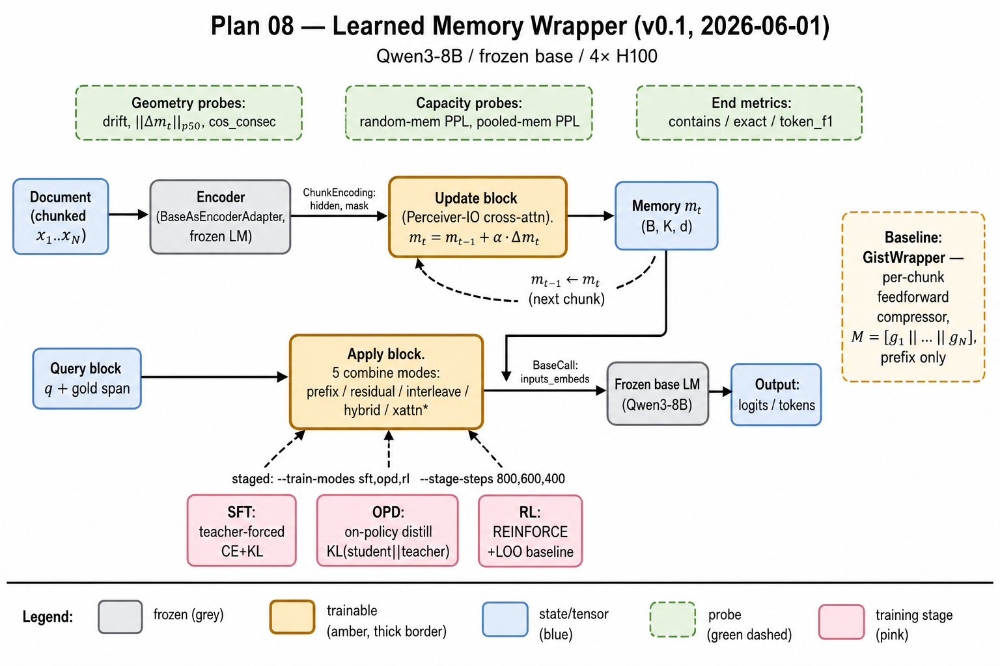

# Plan 08 — misc/

Versioned auxiliary artifacts. Bump the version whenever the architecture,
data flow, or training recipe changes in a way that would change the
diagram.

## Architecture diagrams

Current version: **v0.1** — 2026-06-01

Tracks code state:

| repo | commit |
|---|---|
| `llm-infra` | `a26def4` |
| `encoder-infra` | `7eca190` |
| `mem-embedding` | `269d42b` |

| version | png | tikz | notes |
|---|---|---|---|
| **v0.1** *(current)* | [`architecture-v0.png`](architecture-v0.png) | [`architecture-v0.tex`](architecture-v0.tex) | 5 combine modes (incl. `xattn`), 3 training stages (SFT/OPD/RL), Gist baseline overlay, probe panels (geometry / capacity / end metrics) |



### Compiling the TikZ source

```bash
pdflatex architecture-v0.tex     # → architecture-v0.pdf
# or, to refresh the PNG with publication-quality rasterization:
pdflatex architecture-v0.tex && \
  pdftoppm -r 200 architecture-v0.pdf architecture-v0 -png
```

Required TikZ libraries: `positioning, fit, shapes.geometric,
arrows.meta, calc, decorations.pathreplacing, backgrounds`.

### When to bump the version

Bump to v0.2 if any of the following changes:

* a new combine mode is added or removed
* a new training stage is added (e.g. PPO replacing REINFORCE)
* a new probe family is added or one is retired
* the recurrence equation `m_t = m_{t-1} + α·Δm_t` itself changes
* the encoder is no longer the frozen base (e.g. a separately trained
  encoder)
* a new baseline is added next to GistWrapper that needs to appear in
  the comparison overlay

Bump to v1.0 when the wrapper graduates from a research prototype to a
paper-ready architecture (likely co-incident with the Phase J + 5-seed
results).

## Adding new artifacts

Keep filenames version-suffixed (`<name>-v0.<ext>`) and update this
README's table. PNG goes alongside the source. Do not ever overwrite
an older versioned file — make a new one and bump.
