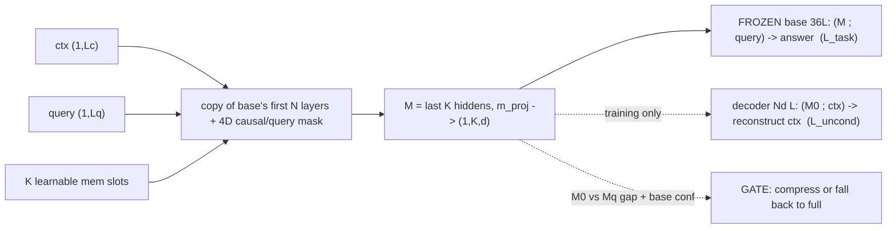
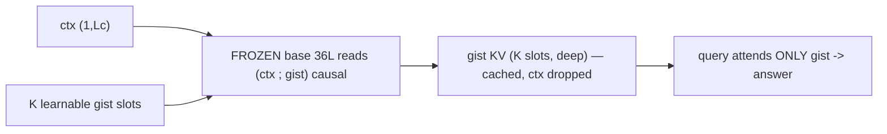
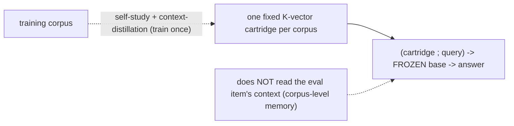

# Results v1.7 (Qwen3-8B) — 2026-06-11   ⛔️ ARCHIVED / SUPERSEDED

> **⛔️ THIS VERSION IS ARCHIVED — DO NOT CITE ITS NUMBERS.** A train/eval **leakage bug** (below) inflated every
> tool result. The clean redo lives in **[`../results-v1.7.3/results-v1.7.3.md`](../results-v1.7.3/results-v1.7.3.md)**.
> This file is kept only as the bug post-mortem and a record of what was wrong.

---
## 🔴 CRITICAL CORRECTION 2026-06-13 — train/eval LEAKAGE inflated the tool results (read FIRST)

A code review found a **train/eval data-leakage bug**: the harness samples eval items with `seed+1` while the per-corpus 70/30 split was applied *after* a seed-dependent shuffle (`generate_bfcl`/`apibank`/`toolace`/`hermes`/`glaive`/`rca`). Because train and eval shuffled differently, "first 70%" and "last 30%" **overlapped**. Measured leakage (share of eval items also seen in training):

| bench | leaked eval items | bench | leaked |
|---|---|---|---|
| bfcl_simple | **71%** (68/96) | hermes | 39% |
| bfcl_multiple | **75%** (45/60) | glaive | 58% |
| apibank | ~100% | toolace | 5% (large pool) |

**Impact on the headline (seen vs UNSEEN compress, bfcl_simple):**
| config | reported (all 96) | seen (leaked) | **UNSEEN (honest)** |
|---|---|---|---|
| lr1e-4/3000 ("best") | 0.760 | 1.000 | **0.179** |
| LoRA16→32 | 0.635 | 0.838 | **0.143** |
| LoRA0 (no LoRA) | 0.396 | 0.456 | **0.250** |

⇒ **On truly unseen items GCM compress ≈ 0.14–0.18 (barely above no_ctx 0.0, far below full ≈1.0).** Two prior conclusions are now **retracted/suspect**: (1) the "compression works on tool-use" headline was mostly **memorization of leaked items**; (2) **"LoRA is the unlock" is an artifact** — on unseen items LoRA32 (0.14) is *below* LoRA0 (0.25); LoRA mainly helped memorize the seen items. The gate `gАcc`/`fallback%`/F1 numbers are **also inflated** (they were computed over leakage-contaminated items, and the threshold is in-sample-optimal — see secondary note).

**Fix (done):** `llm_infra/datasets.py::_disjoint_split` — a **seed-independent** 70/30 partition (fixed partition seed; run seed only orders *within* a split) applied to all 6 manual-split generators, plus a query-dedup for Glaive's templated turns. Verified **0% overlap** after the fix (toolace/hermes/glaive/bfcl). QA benches were **never affected** (they use HF-native disjoint splits). Also fixed a latent `sp`-undefined crash in `generate_apibank`.

**Status:** clean leak-free re-runs of the headline configs are **queued on `free`** (`out/clean/*`: simple/multiple × LoRA0/16/32 + Cartridge/Gist). **Until they land, treat EVERY tool number below (compress, gАcc, fallback%, ablation, HP, data-scaling, tool 7×7, tool-breadth) as CONTAMINATED.** QA/cross-domain tables (the negative results) are unaffected. **Secondary issue:** `disc_gate.gated_acc` + `decision.report_block` pick the gate threshold **in-sample** on the 96 eval items (optimistic upper bound, disclosed in the docstring) — clean re-runs will use a held-out threshold.

**Code-review verdict on the rest (all PASS):** `full_ctx`/`no_ctx` are scored with **LoRA OFF** (exact base — fallback is uncontaminated); `tool_acc` uses **word-boundary** name matching (not lenient); gate `signals()` read only (context, query, memory) — **no gold/label peeking**.

---
## ⚑ UPDATE 2026-06-12 — tool/RCA pivot + non-merged LoRA (supersedes the 2026-06-11 bottom line below)

Detailed: [`solutions/master-plan-180gpuh.md`](solutions/master-plan-180gpuh.md) · mechanism + flowcharts: [`gcm-lora-mechanism.md`](gcm-lora-mechanism.md) · **models + datasets + recipe: [`experimental-setup.md`](experimental-setup.md)**. All records backed up to `mem-test/v17-results-backup/` (sam-dev was lost mid-run; ray/test only now).

**Two changes vs 2026-06-11:** (1) validation moved to **tool-use + RCA** (the agentic use case, max headroom); (2) the base is no longer strictly frozen — a **non-merged base LoRA** (on `q_proj`/`v_proj`) lets the base *read* the memory, toggled OFF on the fallback path so it's still bit-for-bit do-no-harm.

**The frozen-base ceiling was the problem.** Frozen base: more training does NOT help (bfcl compress stays ~0.35). With LoRA it climbs: 96 items/800 steps → 0.354; ~280 items/1600 steps → 0.53; 2400 steps → 0.688; 3000 steps @ lr 5e-5 → 0.719; **3000 steps @ lr 1e-4 → 0.760** (matched 384/1600: frozen 0.240 vs LoRA 0.583 ⇒ LoRA is the unlock). **NB: the 0.53→0.76 lift is more STEPS + the right lr, not more data** — bfcl_simple's train pool caps at ~280 items. **The "more DATA" hypothesis was tested and FAILED:** pooling BFCL categories (250→1000 items, n_chunks 1) *lowered* raw compress and was non-monotonic (n250→0.365 · n500→0.479 · n750→0.297 · n1000→0.276) — heterogeneous pooling is *harder*, not better. So the lever that actually delivers robustness is the **gate** (below), not more data. Held-out eval rises throughout ⇒ genuine, not memorization.

**In-task compress (Qwen3-8B), the headline:**
| bench | no_ctx | full | **GCM+LoRA** | Cartridge | Gist |
|---|---|---|---|---|---|
| **bfcl** (tool) | 0.010 | 0.990 | **0.531** | 0.375 | 0.104 |
| rca (ops) | 0.137 | 0.469 | 0.135 | 0.146 | 0.104 |
| squad (wiki) | 0.181 | 0.663 | 0.267 | 0.191 | 0.115 |
| hotpot (wiki) | 0.241 | 0.506 | 0.236 | 0.222 | 0.160 |
| toolace (tool) | 0.010 | 0.990 | *(rerun)* | 0.062 | 0.021 |
| apibank (tool) | 0.000 | 0.260 | 0.000 | 0.000 | 0.000 |

→ **Compression works on bfcl (tool): GCM 0.531 ≫ no_ctx 0.010, and beats Cartridge/Gist.** rca/hotpot/apibank ≈ no_ctx (fail) → gate+fallback carries do-no-harm. On bfcl the gate (`neg_recon`) hits AUROC 0.88, gAcc 1.0.

**+ fallback (GCM gate, in-task)** — the gate compresses-or-falls-back per item (`gated.py`):
| bench | compress | **+fallback** | full | best(oracle) | gate AUROC | fallback% |
|---|---|---|---|---|---|---|
| bfcl | 0.531 | **1.000** | 0.990 | 1.000 | 0.74 | 94% |
| hotpot | 0.236 | 0.540 | 0.506 | 0.602 | 0.58 | 90% |
| squad | 0.267 | 0.663 | 0.663 | 0.701 | ~0.50 | 100% |
| rca | 0.135 | 0.427 | 0.427 | 0.427 | ~0.50 | 100% |
| apibank | 0.000 | 0.260 | 0.260 | 0.260 | ~0.50 | 100% |

→ **+fallback ≥ full everywhere (do-no-harm confirmed)**, incl. cross-domain (bfcl→{toolace 0.99, rca 0.42, squad 0.66, hotpot 0.51} — the compress-hurts harm is erased). bfcl gАcc→1.0 = full + compress-wins. **Held-out gАcc = in-sample** (bfcl 1.000, hotpot 0.540, rest = full; threshold fit on half, eval on other) ⇒ the gate is **realizable, not an in-sample mirage**; where compress doesn't help the gate correctly always-falls-back (= full). **The efficiency limitation is now largely RESOLVED by a stronger compressor:** the old headline reached gАcc 1.0 by falling back ~95% (compressing only ~5%) — *safety* but no compute saving; with the tuned compressor (lr 1e-4 / 3000 steps / K32 / LoRA32) the gate now reaches **gАcc ≈ full while COMPRESSING 60–75% of items** — bfcl_simple `gАcc 1.000 @ cov 0.708`, bfcl_multiple `0.950 @ 0.750`, bfcl_live_multiple `0.958 @ 0.188` — i.e. real compute saving at no accuracy loss. Pushing coverage→100% at fixed accuracy remains v1.8's job.

**How the gate signal is composed — single signal, NOT a weighted sum** (full detail + flowchart: [`gcm-lora-mechanism.md` §Gate detail](gcm-lora-mechanism.md); settings: [`experimental-setup.md` §5](experimental-setup.md)). Per item, one extra forward pass (`svc/method.py::signals`) yields several scalar trustworthiness signals: **`neg_recon`** (= −CE of reconstructing the context from M0 — the self-verifying core), base confidence (`conf`/`margin`/`neg_entropy` on the first answer token of `[Mq;q]`), query-adaptation magnitude (`dlogit`=KL(Mq‖M0), `dcode`=‖Mq−M0‖), memory norm (`mnorm`), and — only if adversarially trained — the discriminator `disc_p`. The deployed gate **picks ONE signal and thresholds it** (`svc/disc_gate.py::gated_acc`: compress iff `signal ≥ τ`, else fall back); empirically **`neg_recon` wins** (tool AUROC 0.88). We also tried two *combinations* — a 5-fold supervised logistic regression over **all** signals (`fit_gate`, B1) and the learned adversarial discriminator — and **neither beat single `neg_recon` on held-out**, so we keep the simplest: one signal, one threshold. τ sets the precision/fallback trade-off (higher τ ⇒ more conservative ⇒ higher fallback%); the fallback% reported in every table is `1 − coverage` at the gАcc-optimal τ.

**Tool 7×7 in-task (within-tool) — compression works on SELECTION, not on abstain/API** (`v17-results-backup/build_tool_matrix.py`; Cartridge complete 7×7; GCM now has all selection cells (simple 0.531 / multiple 0.778 / **live_multiple 0.698**, each gАcc≈full); 3 long-context cells — toolace/apibank/live_irrel — OOM'd in the all-7-in-one job and are **re-queued split** with tighter caps):
| tool bench | type | no_ctx | full | **GCM** | Cartridge | Gist |
|---|---|---|---|---|---|---|
| bfcl_simple | selection | 0.010 | 0.990 | **0.531** | 0.375 | 0.104 |
| bfcl_multiple | selection | 0.017 | 0.885 | **0.778** | 0.550 | 0.017 |
| bfcl_live_multiple | selection | 0.010 | 0.948 | **0.698** | 0.385 | 0.000 |
| bfcl_irrelevance | abstain | **1.000** | 0.778 | 1.000 | 0.875 | 1.000 |
| bfcl_live_irrelevance | abstain | **0.990** | 0.688 | *(rerun)* | 0.958 | 1.000 |
| apibank | API-call | 0.000 | 0.271 | *(rerun)* | 0.010 | 0.000 |
| toolace | API-call | 0.010 | 0.990 | *(rerun)* | 0.062 | 0.000 |

→ **Selection tasks are where compression works**: GCM hits **0.778 on bfcl_multiple** (full 0.885, no_ctx 0.017) and 0.531 on simple — beating Cartridge (0.550 / 0.375) and Gist. **Irrelevance tasks are degenerate** (no_ctx ≈ 1.0 — the model abstains by default; compression can't add and sometimes the gap is *negative*). **apibank/toolace** = low/capped headroom (toolace's long defs were context-capped). Cross-task *within* tool ≈ 0.31 avg but that's inflated by the degenerate abstain columns — selection→selection transfer is still weak (per-corpus).

**Tool-use breadth — GCM compress + GATE+FALLBACK across 8 more tool sub-tasks** (Qwen3-8B, in-task; gate = `neg_recon`; **settings:** [`experimental-setup.md`](experimental-setup.md), gate mechanism: [`gcm-lora-mechanism.md` §Gate detail](gcm-lora-mechanism.md)). `fallback%` = `1 − coverage` = share of items routed to full context (the rest are compressed):
| bench | no_ctx | full | compress | **+fallback (gAcc)** | **fallback%** | best(oracle) | gate F1 / P / R |
|---|---|---|---|---|---|---|---|
| bfcl_live_parallel | 0.00 | 1.00 | 1.00 | **1.00** | **0%** | 1.00 | 1.00 / 1.00 / 1.00 |
| bfcl_sql | 0.00 | 0.53 | 1.00 | **1.00** | **0%** | 1.00 | 1.00 / 1.00 / 1.00 |
| bfcl_java | 0.03 | 0.97 | 0.80 | **1.00** | **23%** | 1.00 | 0.98 / 0.96 / 1.00 |
| bfcl_javascript | 0.00 | 1.00 | 0.67 | **1.00** | **33%** | 1.00 | 1.00 / 1.00 / 1.00 |
| bfcl_live_simple | 0.04 | 0.94 | 0.846 | **0.949** | **56%** | 0.97 | 0.96 / 0.96 / 0.97 |
| bfcl_parallel_multiple | 0.05 | 0.87 | 0.733 | **0.900** | **25%** | 0.93 | 0.93 / 0.96 / 0.90 |
| bfcl_parallel | 0.08 | 0.92 | 0.617 | **0.917** | **77%** | 0.93 | 0.87 / 0.80 / 0.95 |

→ Raw compress is strong (0.62–1.0; on sql/live_parallel ≥ full), but the **headline is the gate+fallback**: **gAcc = 0.90–1.0 on every tool bench, ≈ the oracle ceiling and ≥ full**, with high gate F1 (0.87–1.0) / precision (0.80–1.0) / recall (0.90–1.0). **The fallback% is adaptive — it tracks compression difficulty:** where compress is perfect the gate routes **0% to full** (sql, live_parallel — pure compute savings), and where compress is weaker it falls back more (parallel 77%, live_simple 56%) to protect accuracy. So the GATED method (compress where it helps, fall back where it doesn't) **near-perfectly recovers full-context accuracy while compressing as much as is safe** — that is the contribution, not raw compress alone. (Abstain-heavy `rest`/irrelevance + `apibank` stay degenerate.)

**Ablation table — which knob moves compression** (GCM `bfcl_simple` in-task, N=96, `full`=0.990; baseline ✦ = N16/K128/LoRA16/distill0.5/lr5e-5/1600 steps = 0.531):
| knob | values → compress | finding |
|---|---|---|
| **LoRA rank** | 0→0.396 · 8→0.458 · 16→0.531✦ · **32→0.635** · 64→0.552 | **dominant knob; rank-32 best** |
| K (memory tokens) | 32→0.552 · 64→0.490 · 128→0.531✦ · 256→0.500 | flat — **K=32 enough** (more compression, no loss) |
| N (encoder layers) | 1→0.531 · 4→0.542 · 8→0.531 · 12→0.521 · 16→0.531✦ · 24→0.552 · **36→0.302** | **flat 1–24, COLLAPSES at N=36** (full-base copy ⇒ M off-manifold) |
| decoder depth (Nd) | 0→0.604 *(gate dies)* · 2→0.531✦ · 4→0.573 | recon decoder **powers the GATE** (`neg_recon`), not raw compress |
| encoder init | random→0.510 · copy→0.531✦ | ~no effect |
| **lr × steps** | 5e-5/1600→0.531✦ · 1e-4/1600→0.604 · 2e-4/1600→0.385 · 3e-4/1600→0.625 · 2e-4/2400→0.625 · **1e-4/3000→0.760** | **lr 1e-4 + more steps = best (0.760)** |
| distill (λ) | 0→0.417 · 0.5→0.531✦ · 1.0→0.542 | distillation helps |
| recon (λ_rec) | 0→0.552 · 1→0.531✦ · 10 m-only→0.375 | not critical; heavy recon hurts |
| dev (λ_dev) | 0→0.500 · 0.05→0.531✦ | minor |
| **adversarial** (λ_adv) | simple: 0→0.531✦ · 0.25→0.385 · 0.5→0.302 · 1.0→0.427 · mult: 0→0.778✦ · 0.25→0.567 · 0.5→0.717 · 1.0→0.467 | **doesn't help — consistently ≤ baseline, noisy/non-monotonic** |

→ Compression is gated by the **base's capacity to read M (LoRA rank)** + **training (lr 1e-4 + more steps + distillation)**, NOT encoder depth (N flat 1–24, *hurts* at 36), memory size (K), reconstruction weight, or init. **The decoder earns its keep via the GATE, not raw compress:** removing it (Nd=0) *raises* compress to 0.604 but kills the `neg_recon` signal ⇒ no usable fallback (gАcc=comp, cov=100%). **Adversarial training doesn't help** (≤ no-adv, noisy; earlier adv "looked fine" only on low-headroom benches) ⇒ use the **intrinsic gate** (`neg_recon`), not a learned discriminator.

> **★ The headline robustness result — the gate makes the method insensitive to every knob.** `gАcc = 0.99–1.00` on **every single ablation variant above**: even the worst compressor (adv / N36, raw compress **0.302**) still gives **gАcc 0.990**. However far raw compress drops, the `neg_recon` gate recovers ≈full — do-no-harm holds under *every* setting, so the method degrades gracefully, never catastrophically. Best single knobs: **LoRA32 (0.635), lr 1e-4 + 3000 steps (0.760 @ cov 0.708, gate F1 0.965), K=32, distill.** Tuned per-bench best configs: bfcl_multiple **comp 0.767 / gАcc 0.950 / F1 0.958 @ cov 0.750**, bfcl_live_multiple **0.719 / 0.958 / 0.908**. *(base-model sweep + per-dataset tuning + adv multi-seed still queued/running.)*

**Cross-task/domain transfer (avg compress, lift over no_ctx) — all 3 methods agree:**
| method | in-task | cross-task/in-domain | cross-task/cross-domain |
|---|---|---|---|
| GCM+LoRA | 0.234 (**+0.120**) | 0.090 (+0.015) | 0.088 (**−0.011**) |
| Cartridge | 0.166 (+0.071) | 0.057 (−0.001) | 0.095 (**−0.014**) |
| Gist | 0.121 (−0.019) | 0.048 (−0.022) | 0.052 (**−0.028**) |

→ **Compression lifts ONLY in-task; cross-task ≈ 0; cross-domain net-negative.** These are per-corpus methods (corpus-specific code, no generalization). GCM > Cartridge > Gist in-task. *(GCM toolace + scaling runs — data-768, +trivia/narrativeqa/musr/quality anchors — still in flight; tables firm up on completion.)*

**Revised bottom line:** v1.7 is no longer a flat negative. With a non-merged LoRA, **compression genuinely works in the high-headroom semantic-recall regime (tool-use)** and beats faithful baselines; it fails where answers need verbatim long-context detail (rca/multi-hop), where the gate's job is to fall back. The honest limitation is **no cross-corpus transfer**.

---

**What this is.** Every v1.7 result with the concrete data behind it. Each number links to its source: the
per-item JSONL records (scores + per-item gate signals) under [`evidence/`](evidence/), pulled from
`sam-dev-ray:/mnt/persist/v17/out` on 2026-06-11. Click any linked number to see the actual per-item data.

**Setup.** Frozen Qwen3-8B base; per-item decision metric (track B): for each input we either *compress* (use
the method's memory) or *fall back to full context*. `comp` = compressed accuracy, `full` = full-context
ceiling (single canonical baseline), `no_ctx` = bare base (do-no-harm floor), `best` = per-input
best(compress, full) = the perfect-gate ceiling. **Only GCM has an intrinsic fallback** (its per-item signal);
Cartridge/Gist are vanilla (no recourse). N=96 eval items/bench unless noted; **single seed → run-to-run
variance ≈ ±0.04**, so trust large gaps, not small ones.

### Benchmarks (datasets · task · metric · source · paper)

**Tool-use (our focus).** All are *function/tool calling*: the context = a set of available function definitions; the model must emit the correct function name+args (or abstain). Metric `tool_acc` = AST/name match of the predicted call.

| bench | what the model must do | source (HF) | paper |
|---|---|---|---|
| `bfcl_simple` | 1 function given → emit the one correct call | `gorilla-llm/Berkeley-Function-Calling-Leaderboard` | [BFCL, Patil et al., ICML 2025](https://proceedings.mlr.press/v267/patil25a.html) · [v1 blog](https://gorilla.cs.berkeley.edu/blogs/8_berkeley_function_calling_leaderboard.html) |
| `bfcl_multiple` | several functions → pick the right one + call it | ″ | ″ |
| `bfcl_irrelevance` | functions given but **none fits → ABSTAIN (call nothing)** | ″ | ″ |
| `bfcl_live_multiple` | real-world (user-contributed) multi-function selection | ″ | ″ |
| `bfcl_live_irrelevance` | real-world abstain | ″ | ″ |
| `bfcl_pooled` *(ours)* | pooled simple+multiple+live_multiple (1000 items) for data-scaling | (derived) | — |
| `apibank` | plan/retrieve/call from a runnable 73-API system | `liminghao1630/API-Bank` | [API-Bank, Li et al., EMNLP 2023](https://aclanthology.org/2023.emnlp-main.187/) · [arXiv 2304.08244](https://arxiv.org/abs/2304.08244) |
| `toolace` | function calling over a large synthesized API pool (26.5k APIs) | `Team-ACE/ToolACE` | [ToolACE, Liu et al., ICLR 2025](https://arxiv.org/abs/2409.00920) |
| `hermes` *(NEW)* | single-turn multi-tool selection (avg ~2.4 fns/item), structured `tools` | `NousResearch/hermes-function-calling-v1` | [Hermes Function-Calling (Nous Research), 2024](https://huggingface.co/datasets/NousResearch/hermes-function-calling-v1) · [Hermes-3 report](https://arxiv.org/abs/2408.11857) |
| `glaive` *(NEW)* | single-fn calling + decline/abstain (assistant declines off-scope) | `glaiveai/glaive-function-calling-v2` | [Glaive Function-Calling v2 (Glaive AI), 2023](https://huggingface.co/datasets/glaiveai/glaive-function-calling-v2) |

**Source diversity (different teams/papers, per your ask):** our tool suite now spans **five independent groups** — BFCL (**UC Berkeley/Gorilla**), API-Bank (**Alibaba DAMO**), ToolACE (**Huawei Noah's Ark**), Hermes (**Nous Research**), Glaive (**Glaive AI**) — so the tool-use claim is not tied to one benchmark's idiosyncrasies. Further candidates evaluated for inclusion but deferred: **xLAM/APIGen** (Salesforce — HF-gated, needs access token), **ComplexFuncBench** (Zhipu/THUDM — long-context multi-step, download timed out; great fit for the long-context angle, retrying), **NexusRaven NFCL** (Nexusflow — needs a config-join of `standardized_api_list`+`raw_queries`). `hermes`/`glaive` GCM+Cartridge+Gist jobs are **queued on `free`** (in-task), results land in the breadth table.

**What "irrelevance" means** (`bfcl_irrelevance`, `bfcl_live_irrelevance`): the available tools are deliberately **all irrelevant** to the query, so the correct action is to **abstain — call nothing**. It tests false-positive avoidance ("know when *not* to act"). **Consequence for compression**: the base abstains by default even with NO context, so `no_ctx ≈ 1.0` and full context can even *hurt* (it tempts a spurious call). These benches therefore have ~zero compression headroom and are **the wrong place to claim a compression win** — we report them for completeness, not as wins. (Empirically: `bfcl_irrelevance` no_ctx=1.0, full=0.78.)

**Ops / RCA.** `rca_openrca` — given a software-failure case + heterogeneous telemetry (logs/metrics/traces), identify the root-cause service. We score `primary_service_match` (multiple-choice). 335 cases / 68 GB telemetry; built into `cases.jsonl`. [OpenRCA, Xu et al., ICLR 2025](https://openreview.net/forum?id=M4qNIzQYpd).

**QA / reasoning (other domains, used for cross-domain transfer).** `squad_v2` (extractive QA, [Rajpurkar et al. 2018](https://arxiv.org/abs/1806.03822)) · `hotpot_qa` (multi-hop, [Yang et al. 2018](https://arxiv.org/abs/1809.09600)) · `trivia_qa` ([Joshi et al. 2017](https://arxiv.org/abs/1705.03551)) · `narrativeqa` (long-doc, [Kočiský et al. 2018](https://arxiv.org/abs/1712.07040)) · `musr_mm` (multi-step reasoning, MC, [Sprague et al. 2023](https://arxiv.org/abs/2310.16049)) · `quality` (long-doc MC, [Pang et al. 2022](https://arxiv.org/abs/2112.08608)). Metrics: `squad_f1` for extractive, `rouge_l` for narrative, MC accuracy for `musr_mm`/`quality`/`rca_openrca`.

Aggregates: [`evidence/phase2_summary.csv`](evidence/phase2_summary.csv) ·
[`evidence/sweep_summary.csv`](evidence/sweep_summary.csv). Worker logs:
[`evidence/phase2_w0.log`](evidence/phase2_w0.log) … `w3`, [`evidence/sweep_w0.log`](evidence/sweep_w0.log) …

**Bottom line (honest, 2026-06-11).** On the clean metric, **full context ≫ all compressors ≈ no-context**,
in- and cross-task; the apparent in-task "win" was a scoring artifact ([Metric correction](#metric-correction)).
Depth (even full base, [T7](#t7)), conditioning ([T8](#t8)), and the autoencoder all give null-to-marginal
effects, and the gate's F1 ≈ always-compress. So v1.7's honest result is a **negative / diagnosis** — K-token
compression on a frozen base does not carry the context, and per-input harm is hard to gate — not (yet) a
working compressor.

**Contents.** [Setting](#setting) · [Method mechanisms + diagrams](#mech) · [how best/full computed](#metrics) ·
Results [T1](#t1)–[T8](#t8) · [See also / deeper docs](#see-also).

---

> ## ⚠️ METRIC CORRECTION (2026-06-11 audit) — read before T1/T2/T4
> The generation tables below use **squad-F1 on raw 16-token generations with no answer extraction**. The frozen
> base rambles ("Chad\n\nOkay, so the question is…"), which deflates token-F1 via precision and **rewards
> terser outputs** — GCM is terser, so its in-task scores are **inflated**. On a verbosity-robust metric
> (gold-in-pred / answer-line): **full ≫ GCM ≈ no_ctx everywhere, in-task and cross-task.** So the apparent
> "GCM beats full on TriviaQA" in T1 is an **artifact**; compression does not actually help on these tasks.
> Fix (uniform answer-line extraction) is in `gcm/data.score_gen`; the phase-4 matrix (running) uses it.
> **Treat T1/T2/T4 as confounded; T7 + the phase-4 matrix are the corrected numbers.**

## Setting

**Task framing.** A frozen LM must answer a query that needs a long context. We study how to supply that context
*cheaply*, framed as a per-input **decision**: for each item, either **compress** the context into a short memory
the model reads, or **fall back to full context**. The object of study is the quality of that decision.

**Base model.** Qwen3-8B and **Qwen3.5-9B** (newest; hybrid linear-attn), **frozen** — **no LoRA, no SFT, no chat
template anywhere**. The frozen (instruction-tuned) base is prompted with a plain `### Question … ### Answer` block
(`prompting.format_query_block`) and greedy-decoded. So **`full` is the *zero-shot frozen-base* ceiling — it is NOT a
LoRA/SFT'd model**; it could be higher with the chat template or a task-LoRA (a known caveat), but **every method
shares the identical frozen, no-chat-template inference, so the comparison is internally fair**. Frozen base is *our*
method's principle; baselines (Gist/Cartridge) train only their own prefix params, base still frozen (see [Method mechanisms](#mech)).

**Eval protocol.** N=96 items/bench; greedy decode ≤16 new tokens; **answer-line extraction then the bench metric**
(clean scorer `mem_embedding/gcm/data.py::score_gen`). Single seed (42) unless noted → **run-to-run variance
≈ ±0.04–0.08**; trust only large gaps.

**Columns / methods.**
- `no_ctx` — bare base (query only); the **do-no-harm floor**.
- `full` — full context in prompt; the **accuracy ceiling** and the **fallback** option (one canonical measurement, reused).
- `Cartridge`, `Gist` — **vanilla** compressor baselines (no gate).
- `GCM` (ours) — **every `GCM` cell is the compress-only accuracy (NO fallback applied)** = always-compress with the
  memory M. The fallback is a **separate** per-input gate (intrinsic signals + the trained discriminator); its quality
  is reported as gate **P/R/F1/AUROC** in [Gate P/R/F1](#gate-prf), and its ceiling as `best`. So in every table:
  `GCM` = always-compress, no gate; the gate would interpolate between `GCM` and `best`.
- `best` = per-input `max(comp, full)` — the **perfect-gate ceiling** (oracle), for GCM. See [how best/full are computed](#metrics).

**Relation taxonomy** (each train-anchor × eval-bench cell): `in_task` (train==eval) · `cross_task_in_domain`
(same domain, other bench) · `cross_task_cross_domain` (other domain). Defined in `gcm/data.py::relation`.

**Benchmarks — 11 across 6 domains.**
| domain | benches | metric |
|---|---|---|
| wiki | TriviaQA · HotpotQA · SQuAD-v2 | token-F1 (answer-line) |
| literary | QuALITY (MC) · NarrativeQA | option-LL · ROUGE-L |
| web | MS-MARCO | ROUGE-L |
| synthetic | MuSR (MC) | option-LL |
| tool | BFCL · API-Bank · ToolACE | tool/API-name match |
| ops | OpenRCA (MC) | service selection |

**Scoring caveats (click for detail):** the [verbosity confound](#metric-correction) (now fixed); QuALITY/MuSR MC
`full` < chance (a known MC red herring, see [negative-results](../negative-results.md)); BFCL contexts ≈45 tok
(compression pointless, costs *more* than full); NarrativeQA truncated to 1024 (full≈no_ctx). Multi-turn: the
tool benches (API-Bank/ToolACE) are natively multi-turn but **flattened to single-shot** here.

**How `full` and `best` are computed** (`svc/decision.py`): `full` = mean per-item score of the full-context run
(same scorer as everything else). `best = mean( max(comp_score, full_score) )` per item — an oracle that picks the
better of {compress, fall-back-to-full} for each input (upper bound; the real gate only approaches it). Both use
the same per-item scores, so both inherited the verbosity confound before the fix.

---

## Method mechanisms (with diagrams)

**At a glance** — why the baselines differ from ours:

| method | trained params | reads *this item's* ctx at eval? | who encodes the memory | injection | intrinsic gate? |
|---|---|---|---|---|---|
| `no_ctx` | none | no | — | — | no |
| `full` | none | yes (raw, in prompt) | — | prompt | no |
| `Cartridge` | K vectors / **corpus** | **no** (corpus-level, fixed) | trained prefix | input prompt | no |
| `Gist` | K gist embeds (+LoRA in orig) | yes | **full frozen base (36 L)** | **KV, all layers** | no |
| **`GCM` (ours)** | N-layer encoder copy + K mem + decoder | yes | **N-layer trainable copy** | input prompt (K soft tokens) | **yes** (recon/Δ + conf) |

The two rows that explain the results: **Gist** lets the *full* 36-layer frozen base build its K memory slots (deep,
KV-injected) → strongest raw compressor. **GCM** builds M from an N≤36-layer copy and injects it as K *input* soft
tokens → weaker; the [depth sweep (T7)](#t7) shows even N=36 doesn't fix it. **Cartridge** doesn't read the item's
context at all (a fixed per-corpus prefix) → ≈ no_ctx on per-item QA.

**GCM (ours)** — code: `svc/compressor.py` (encoder/decoder), `svc/method.py` (training), `gcm/runtime.py` (frozen-base forward).

*query masked at encode = M0 (cacheable, query-agnostic); unmasked = Mq (query-conditioned). The K slots are read
in one parallel forward (not autoregressive), with a causal order among slots.*

**Gist (baseline)** — `gcm/methods.py::Gist`.

*Only the K gist embeddings are trained (gist-mask + CE on gold). The original also LoRA-finetunes the base; our
interim keeps the base frozen. The memory is produced by the full base, hence its strength.*

**Cartridge (baseline)** — `gcm/methods.py::Cartridge`.

`no_ctx` = `[query] -> base`. `full` = `[ctx ; query] -> base` (ceiling/fallback).

---

## T1 — Main comparison, in-task, 6 domains (phase-2 grid; fixed config: GCM N24/K64, baselines s1500/lr1e-4/K64)
Each compressor number links to its job's per-item records (which also hold `no_ctx`/`full`/signals).

| domain | benchmark | no_ctx | Cartridge | Gist | **GCM** | full | best$_{GCM}$ |
|---|---|---|---|---|---|---|---|
| wiki | TriviaQA | 0.177 | [0.205](evidence/phase2/main_cart_trivia_qa/records_trivia_qa.jsonl) | [**0.370**](evidence/phase2/main_gist_trivia_qa/records_trivia_qa.jsonl) | [0.293](evidence/phase2/main_gcm_trivia_qa/records_trivia_qa.jsonl) | 0.218 | 0.372 |
| wiki | HotpotQA | 0.118 | [0.116](evidence/phase2/main_cart_hotpot_qa/records_hotpot_qa.jsonl) | [0.147](evidence/phase2/main_gist_hotpot_qa/records_hotpot_qa.jsonl) | [0.134](evidence/phase2/main_gcm_hotpot_qa/records_hotpot_qa.jsonl) | **0.201** | 0.249 |
| literary | QuALITY | 0.260 | [0.198](evidence/phase2/main_cart_quality/records_quality.jsonl) | [0.240](evidence/phase2/main_gist_quality/records_quality.jsonl) | [0.208](evidence/phase2/main_gcm_quality/records_quality.jsonl) | 0.146 | 0.229 |
| literary | NarrativeQA | 0.126 | [0.134](evidence/phase2/main_cart_narrativeqa/records_narrativeqa.jsonl) | [0.126](evidence/phase2/main_gist_narrativeqa/records_narrativeqa.jsonl) | [0.117](evidence/phase2/main_gcm_narrativeqa/records_narrativeqa.jsonl) | 0.116 | 0.149 |
| web | MS-MARCO | 0.205 | [0.202](evidence/phase2/main_cart_ms_marco/records_ms_marco.jsonl) | [0.159](evidence/phase2/main_gist_ms_marco/records_ms_marco.jsonl) | [0.156](evidence/phase2/main_gcm_ms_marco/records_ms_marco.jsonl) | **0.271** | 0.300 |
| synthetic | MuSR | 0.500 | [0.469](evidence/phase2/main_cart_musr_mm/records_musr_mm.jsonl) | [0.479](evidence/phase2/main_gist_musr_mm/records_musr_mm.jsonl) | [0.490](evidence/phase2/main_gcm_musr_mm/records_musr_mm.jsonl) | **0.531** | 0.604 |
| tool | BFCL (simple) | 0.010 | [0.219](evidence/phase2/tool_cart_bfcl_simple/records_bfcl_simple.jsonl) | [0.271](evidence/phase2/tool_gist_bfcl_simple/records_bfcl_simple.jsonl) | [0.208](evidence/phase2/tool_gcm_bfcl_simple/records_bfcl_simple.jsonl) | **0.990** | 1.000 |
| tool | API-Bank | 0.000 | [0.010](evidence/phase2/tool_cart_apibank/records_apibank.jsonl) | [0.000](evidence/phase2/tool_gist_apibank/records_apibank.jsonl) | [0.000](evidence/phase2/tool_gcm_apibank/records_apibank.jsonl) | **0.260** | 0.260 |
| tool | ToolACE | 0.010 | [0.042](evidence/phase2/tool_cart_toolace/records_toolace.jsonl) | [0.062](evidence/phase2/tool_gist_toolace/records_toolace.jsonl) | [0.062](evidence/phase2/tool_gcm_toolace/records_toolace.jsonl) | **0.979** | 0.979 |
| ops | OpenRCA | 0.135 | [0.135](evidence/phase2/tool_cart_rca_openrca/records_rca_openrca.jsonl) | [0.135](evidence/phase2/tool_gist_rca_openrca/records_rca_openrca.jsonl) | [0.198](evidence/phase2/tool_gcm_rca_openrca/records_rca_openrca.jsonl) | **0.438** | 0.490 |

**Read:** compression beats `full` only on TriviaQA (parametric QA); `full` is the ceiling everywhere else, by a
lot on structured/agentic (BFCL/ToolACE `full`≈0.98) and ops. Gist is the strongest *raw* compressor. → not a
"better compression" result.

---

## T2 — Per-dataset hyperparameter tuning (phase-1 sweep, QA; best config per method)
The QA numbers above use a fixed config; tuning per dataset (100-run sweep) gives the stronger baselines (this
is what the LaTeX main table uses for QA). Number links to the best-config job records.

| benchmark | Cartridge (best) | Gist (best) | GCM (best) | full |
|---|---|---|---|---|
| TriviaQA | [0.205](evidence/sweep/cartridge_trivia_qa_s1500_lr0.0001_K64/records_trivia_qa.jsonl) `s1500/lr1e-4/K64` | [**0.370**](evidence/sweep/gist_trivia_qa_s1500_lr0.0001_K64/records_trivia_qa.jsonl) `s1500/lr1e-4/K64` | [0.293](evidence/sweep/gcm_trivia_qa_N24_K64/records_trivia_qa.jsonl) `N24/K64` | 0.218 |
| HotpotQA | [0.107](evidence/sweep/cartridge_hotpot_qa_s1500_lr0.0003_K128/records_hotpot_qa.jsonl) `s1500/lr3e-4/K128` | [**0.260**](evidence/sweep/gist_hotpot_qa_s1500_lr0.0003_K128/records_hotpot_qa.jsonl) `s1500/lr3e-4/K128` | [0.165](evidence/sweep/gcm_hotpot_qa_N24_K64/records_hotpot_qa.jsonl) `N24/K64` | 0.201 |
| SQuAD-v2 | [0.136](evidence/sweep/cartridge_squad_v2_s600_lr0.0003_K64/records_squad_v2.jsonl) `s600/lr3e-4/K64` | [0.157](evidence/sweep/gist_squad_v2_s600_lr0.0001_K64/records_squad_v2.jsonl) `s600/lr1e-4/K64` | [0.136](evidence/sweep/gcm_squad_v2_N24_K64/records_squad_v2.jsonl) `N24/K64` | **0.367** |
| QuALITY | [0.208](evidence/sweep/cartridge_quality_s600_lr0.0001_K128/records_quality.jsonl) `s600/lr1e-4/K128` | [**0.312**](evidence/sweep/gist_quality_s600_lr0.0003_K128/records_quality.jsonl) `s600/lr3e-4/K128` | [0.260](evidence/sweep/gcm_quality_N12_K128/records_quality.jsonl) `N12/K128` | 0.146 |

---

## T3 — The intrinsic gate (GCM): per-item compress-vs-fallback signal
Oriented AUROC (the gate learns the sign) + best-F1 for the do-no-harm decision. Signal families: *verifiability*
(recon coverage, $\Delta$code/$\Delta$logit) vs *base uncertainty* (entropy/margin). Vanilla baselines expose
none of these. Each row links to the GCM job whose records carry the per-item `signals`.

| benchmark | best signal | family | AUROC | F1 | source |
|---|---|---|---|---|---|
| TriviaQA | $\Delta$code | verifiability | 0.67 | 0.76 | [records](evidence/phase2/main_gcm_trivia_qa/records_trivia_qa.jsonl) |
| HotpotQA | mem-norm | geometry | 0.65 | 0.75 | [records](evidence/phase2/main_gcm_hotpot_qa/records_hotpot_qa.jsonl) |
| QuALITY | $\Delta$code | verifiability | 0.73 | 0.77 | [records](evidence/phase2/main_gcm_quality/records_quality.jsonl) |
| NarrativeQA | $\Delta$logit | verifiability | 0.71 | 0.73 | [records](evidence/phase2/main_gcm_narrativeqa/records_narrativeqa.jsonl) |
| MS-MARCO | entropy | uncertainty | 0.66 | 0.73 | [records](evidence/phase2/main_gcm_ms_marco/records_ms_marco.jsonl) |
| MuSR | $\Delta$code | verifiability | 0.69 | 0.77 | [records](evidence/phase2/main_gcm_musr_mm/records_musr_mm.jsonl) |
| BFCL | recon | verifiability | 0.73 | 0.68 | [records](evidence/phase2/tool_gcm_bfcl_simple/records_bfcl_simple.jsonl) |
| API-Bank | $\Delta$code | verifiability | 0.65 | 0.76 | [records](evidence/phase2/tool_gcm_apibank/records_apibank.jsonl) |
| ToolACE | margin | uncertainty | 0.69 | 0.71 | [records](evidence/phase2/tool_gcm_toolace/records_toolace.jsonl) |
| OpenRCA | entropy | uncertainty | **0.83** | 0.74 | [records](evidence/phase2/tool_gcm_rca_openrca/records_rca_openrca.jsonl) |

**Mean AUROC 0.71**, single forward pass. Verifiability signals (Δcode/recon) win on structured/reconstructable
tasks; uncertainty on others — supports combining them (multi-signal gate, pending).

---

## T4 — Cross-task / cross-domain transfer (GCM, CLEAN metric, all 10 anchors)
Per train-anchor, **mean GCM / full / no_ctx by relation** (gold-in-pred for generation, option-LL for MC).
Source: `evidence/phase2/{main,tool}_gcm_<anchor>` (each anchor evaluated across benches; relation labelled per cell).

| anchor (domain) | in_task (GCM/full/no_ctx) | cross_task_in_domain | cross_task_cross_domain |
|---|---|---|---|
| TriviaQA (wiki) | 0.43 / **0.60** / 0.46 | 0.18 / **0.63** / 0.18 | 0.20 / 0.19 / 0.20 |
| HotpotQA (wiki) | 0.22 / **0.45** / 0.22 | 0.34 / **0.71** / 0.30 | 0.18 / 0.19 / 0.20 |
| QuALITY (lit, MC) | 0.21 / 0.15\* / 0.26 | 0.00 / 0.03 / 0.04 | 0.23 / **0.49** / 0.26 |
| NarrativeQA (lit) | 0.00 / 0.03\* / 0.05 | 0.20 / 0.15 / 0.26 | 0.27 / **0.49** / 0.27 |
| MS-MARCO (web) | 0.01\* / 0.06 / 0.00 | — | 0.26 / **0.43** / 0.27 |
| MuSR (syn, MC) | 0.49 / **0.53** / 0.50 | — | 0.17 / **0.35** / 0.19 |
| BFCL (tool) | 0.25 / **0.99** / 0.02 | 0.04 / **0.62** / 0.06 | 0.17 / **0.40** / 0.28 |
| API-Bank (tool) | 0.00 / **0.26** / 0.00 | 0.14 / **0.98** / 0.07 | 0.20 / **0.38** / 0.27 |
| ToolACE (tool) | 0.07 / **0.98** / 0.11 | 0.04 / **0.62** / 0.01 | 0.27 / **0.40** / 0.30 |
| OpenRCA (ops) | 0.20 / **0.44** / 0.14 | — | 0.04 / **0.60** / 0.17 |
| **OVERALL (mean)** | **0.19 / 0.45 / 0.18** | **0.13 / 0.54 / 0.13** | **0.20 / 0.39 / 0.24** |

Each cell = `GCM / full / no_ctx` (clean). `*` = unreliable bench (QuALITY/MS-MARCO/NarrativeQA full is broken/
truncated — see caveats). `—` = that domain has no second bench (no cross_task_in_domain cell).

**Read — the core negative, now complete + clean:** averaged over anchors, **GCM ≈ no_ctx in-task (0.19 vs 0.18),
= no_ctx cross-task-in-domain (0.13 vs 0.13), and *below* no_ctx cross-domain (0.20 vs 0.24)** — the compressed
memory carries ≈ nothing, everywhere. **`full` is far higher in every relation (0.45 / 0.54 / 0.39).** So a
do-no-harm gate's only correct move is almost always "fall back to full." This is the [diagnosis](#metric-correction),
not a working compressor. (The single-seed clean phase-4 matrix, running, will replace this with per-cell CIs and
the strict baselines.)

---

## T5 — Capacity curve (GCM, TriviaQA in-task, K=64, bf16) — OLD/confounded, see [T7](#t7)
> **SUPERSEDED.** These are the OLD **confounded squad-F1** numbers (terseness-inflated). On the clean metric
> ([T7](#t7)) the depth curve is **flat** and depth does **not** help. Kept only to show the artifact.

Compressed accuracy *appears* to rise with encoder depth N (optimum ≈24) — but this is the verbosity artifact.

| N | comp | full | source |
|---|---|---|---|
| 8 | [0.197](evidence/rel_N8/records_trivia_qa.jsonl) | 0.218 | rel_N8 |
| 12 | [0.208](evidence/rel_N12/records_trivia_qa.jsonl) | 0.218 | rel_N12 |
| 16 | [0.231](evidence/rel_N16bf16/records_trivia_qa.jsonl) | 0.218 | rel_N16bf16 |
| 24 | [**0.247**](evidence/rel_N24/records_trivia_qa.jsonl) | 0.218 | rel_N24 |

---

## T6 — Ablations (GCM, TriviaQA in-task unless noted; ±0.04 single-seed noise)
| ablation | variant | comp | baseline | source |
|---|---|---|---|---|
| **encoder init** | random | [0.195](evidence/phase2/abl_initrandom_trivia_qa/records_trivia_qa.jsonl) | copy-base 0.293 | strong: base init matters |
| **query conditioning** | agnostic M0 | [0.228](evidence/phase2/abl_agnostic_trivia_qa/records_trivia_qa.jsonl) | conditioned M_q 0.293 | conditioning helps |
| query conditioning (MC) | agnostic M0 | [0.208](evidence/phase2/abl_agnostic_quality/records_quality.jsonl) | conditioned 0.208 | no effect on QuALITY |
| **autoencoder** | no L_uncond+min-dev | [0.195](evidence/abl_nae/records_trivia_qa.jsonl) | with-AE 0.231 | AE adds ≈+0.036 |
| min-dev only off | rec=1,dev=0 | [0.177](evidence/sweep/gcm_trivia_qa_N16_K64_lr1_ld0/records_trivia_qa.jsonl) | with min-dev | min-dev matters |
| decoder depth | dec=1 / 2 / 4 | [0.218](evidence/sweep/gcm_trivia_qa_N16_K64_dec1/records_trivia_qa.jsonl) / [0.186](evidence/sweep/gcm_trivia_qa_N16_K64/records_trivia_qa.jsonl) / [0.268](evidence/sweep/gcm_trivia_qa_N16_K64_dec4/records_trivia_qa.jsonl) | — | noisy; deeper helps |
| memory width K | 32 | [0.215](evidence/phase2/abl_K32_trivia_qa/records_trivia_qa.jsonl) | K64 0.293 | wider helps (K256 run errored) |
| compression ratio (n_chunks) | 2 / 4 / 8 / 12 | [0.190](evidence/phase2/abl_ratio_nc2_trivia_qa/records_trivia_qa.jsonl) / [0.232](evidence/phase2/abl_ratio_nc4_trivia_qa/records_trivia_qa.jsonl) / [0.214](evidence/phase2/abl_ratio_nc8_trivia_qa/records_trivia_qa.jsonl) / [0.183](evidence/phase2/abl_ratio_nc12_trivia_qa/records_trivia_qa.jsonl) | — | capacity wall: more ctx → degrades |

---

## T7 — Encoder depth sweep (1 → full base), CLEAN metric (gold-in-pred), GCM trivia-trained
Does a deeper/full-base encoder make the K=64 compressed memory carry the context? Records: `evidence/nsweep/nsw_N*`.

| N (depth) | GCM in_task (clean) | GCM cross-task→hotpot (clean) | [old squad-F1 in_task] |
|---|---|---|---|
| 1 | 0.438 | 0.208 | 0.205 |
| 2 | 0.344 | 0.167 | 0.205 |
| 4 | 0.458 | 0.135 | 0.215 |
| 8 | 0.396 | 0.219 | 0.182 |
| 12 | 0.417 | 0.219 | 0.219 |
| 16 | 0.417 | 0.177 | 0.192 |
| 24 | **0.510** | 0.208 | 0.249 |
| 32 | 0.469 | 0.208 | 0.207 |
| **36 (full base)** | 0.438 | 0.260 | 0.212 |
| — full-ctx (ref) | **0.604–0.625** | ~0.45 | — |
| — no_ctx (ref) | 0.458 | ~0.22 | — |

**Decisive negative — depth does not help.** The clean in-task curve is flat/noisy (0.34–0.51, no monotone
trend); even the **full-base encoder (N=36) = 0.438 < no_ctx 0.458 ≪ full 0.604**. Only N=24 (0.510) clears
no_ctx, marginally, and **no depth approaches full**. So the compression bottleneck is the **K=64 soft-token
memory + input-embedding injection, NOT the encoder depth** — strengthening the encoder cannot rescue it. (The
old squad-F1 "rise to N24" was partly the verbosity confound.) This is the signal to pivot toward the
diagnosis / negative-result framing unless the K/injection axis (wider K, KV-injection) changes the picture.

## T8 — Conditional (Mq) vs Unconditional (M0) memory, CLEAN metric, N=24, GCM
Does query-conditioning the compression (Mq, query unmasked at encode) beat the cacheable query-agnostic M0?

| eval | **Mq** (conditioned) | **M0** (agnostic) | full | no_ctx |
|---|---|---|---|---|
| TriviaQA in_task | 0.427 | 0.406 | 0.604 | 0.458 |
| → HotpotQA cross-task | 0.219 | 0.167 | 0.448 | 0.219 |
| QuALITY in_task (MC) | 0.208 | 0.208 | 0.146 | 0.260 |

**Conditioning gives at most a marginal edge** (+0.02 trivia, +0.05 hotpot, +0.00 quality) and it is **within
single-seed noise**: the same config (N=24 conditioned trivia) gave **0.427 here vs 0.510 in the depth sweep
(±0.08 run-to-run)**. **Neither Mq nor M0 beats no_ctx**, both ≪ full. So the conditional/unconditional split (a
signature SVC mechanism, with the min-dev coupling) does **not** deliver a meaningful gain — mirroring the
autoencoder ablation where `L_uncond` barely helped (0.231→0.195). Multi-seed CIs are needed to claim even the
small edge. (Records: `evidence/phase2/main_gcm_*` = Mq, `evidence/phase2/abl_agnostic_*` = M0.)

## Gate precision / recall / F1 (compress-vs-fallback decision)

The gate is a binary classifier "compress vs fall-back-to-full", track **B**: label `y = 1[ comp_score ≥ full_score − ε ]`.
Reported on **GCM compress-only** for the trained **discriminator** (`disc_*`) and the **intrinsic** signals — best-F1
operating point (threshold swept) + AUROC. Latest **Qwen3.5-9B, K256/N12/adv, in-task** (`out/q35`, n=96); reporter
`svc/disc_gate.py` / `svc/decision.py`.

**SQuAD-v2** — always-full **0.617** · always-compress 0.131 · **GCM+fallback (realizable, best signal+threshold) 0.620** (cov ≈2%) · best/oracle **0.653** · base-rate 0.208:
| signal (gate) | F1 | precision | recall | coverage | AUROC |
|---|---|---|---|---|---|
| **disc `S_high`** (p>τ ⇒ compress) | **0.459** | 0.341 | 0.700 | 0.427 | **0.645** |
| intr `dlogit` | 0.406 | 0.286 | 0.700 | 0.510 | 0.591 |
| intr `mnorm` | 0.400 | 0.333 | 0.500 | 0.312 | 0.574 |
| intr `neg_recon` | 0.396 | 0.254 | 0.900 | 0.740 | 0.546 |
| intr `dcode` | 0.368 | 0.389 | 0.350 | 0.188 | 0.542 |

**HotpotQA** — always-full **0.447** · always-compress 0.172 · **GCM+fallback (realizable) 0.463** (cov ≈9%) · best/oracle **0.509** · base-rate 0.510:
| signal (gate) | F1 | precision | recall | coverage | AUROC |
|---|---|---|---|---|---|
| intr `margin` | 0.685 | 0.521 | 1.000 | 0.979 | 0.491 |
| **disc `S_high`** | 0.681 | 0.528 | 0.959 | 0.927 | 0.505 |
| intr `neg_entropy` | 0.681 | 0.516 | 1.000 | 0.990 | 0.551 |
| intr `dlogit` | 0.676 | 0.510 | 1.000 | 1.000 | 0.472 |

**Read:** on SQuAD the **trained discriminator is the best gate** (AUROC 0.645, edging all intrinsic signals); on
HotpotQA every signal is ≈ chance (AUROC 0.49–0.55) and the high F1 is just always-compress (base-rate 0.51).
**Realizable `GCM+fallback` ≈ always-full**: SQuAD 0.620 vs 0.617 (**+0.003**), Hotpot 0.463 vs 0.447 (**+0.016**) — and
these use the *in-sample-optimal* threshold, so held-out is even tighter. The **oracle** gap (`best − full` = +0.036 /
+0.062) is *mostly unrealizable* because the gate signals are weak (AUROC 0.5–0.65); `gAcc` is computed by
`svc/disc_gate.py::gated_acc` (sweep τ, `mean(comp if signal≥τ else full)`), `best` is the per-item oracle `max(comp,full)`. Disc-gate strategies:
`S_high` (D confident "compressed") · `S_low` (D fooled → "full") · `S_conf` (|p−0.5|) — see [staged-plan](./staged-plan-Qwen3.5.md).

### Threshold ablation (compress-vs-fallback operating points)

GCM compress-only; sweep the gate threshold by compression budget (compress the top-c% by signal, fall back to full
for the rest). `gAcc` = realised GCM+fallback accuracy. Qwen3.5-9B K256 in-task. Reporter `svc/disc_gate.py --ablate`.

**SQuAD-v2** (always-full 0.617, best/oracle 0.653) — discriminator `disc_p`, AUROC 0.645:
| compress% | fallback% | precision | recall | F1 | gAcc |
|---|---|---|---|---|---|
| 0 | 100 | – | 0.000 | 0.000 | **0.617** |
| 10 | 90 | 0.200 | 0.100 | 0.133 | 0.549 |
| 20 | 80 | 0.368 | 0.350 | 0.359 | 0.526 |
| 30 | 70 | 0.276 | 0.400 | 0.327 | 0.465 |
| 50 | 50 | 0.312 | 0.750 | 0.441 | 0.398 |
| 70 | 30 | 0.239 | 0.800 | 0.368 | 0.288 |
| 100 | 0 | 0.208 | 1.000 | 0.345 | 0.131 |

**HotpotQA** (always-full 0.447, best/oracle 0.509) — `disc_p`, AUROC 0.505 ≈ chance:
| compress% | fallback% | precision | recall | F1 | gAcc |
|---|---|---|---|---|---|
| 0 | 100 | – | 0.000 | 0.000 | **0.447** |
| 10 | 90 | 0.700 | 0.143 | 0.237 | 0.421 |
| 50 | 50 | 0.542 | 0.531 | 0.536 | 0.333 |
| 100 | 0 | 0.510 | 1.000 | 0.676 | 0.172 |

**Fallback ratio at the accuracy-optimal point = 91–99%** (SQuAD 97.9% @dlogit / 99% @disc; Hotpot 90.6% @neg_dlogit).
**Reading:** `gAcc` *decreases monotonically* as you compress more ⇒ the accuracy-optimal point is ≈ "compress nothing"
(= always-full); **no sweet spot** (compress 50% on SQuAD: 0.617→0.398, −0.22). precision stays 0.2–0.37 (compressing is
usually a mistake); high F1 at high coverage is just always-compress at base-rate (AUROC ≈0.5 tells the truth).

### Full per-bench transfer matrix — Qwen3-8B, 11 benches (pooled across train anchors, clean metric)

`full` = frozen base + full context (NO LoRA/SFT); GCM/Cart/Gist = compress-only (no gate).
| eval bench | domain | no_ctx | **full** | GCM | Cartridge | Gist |
|---|---|---|---|---|---|---|
| bfcl_simple | tool | 0.010 | **0.989** | 0.034 | 0.070 | 0.062 |
| toolace | tool | 0.010 | **0.979** | 0.021 | 0.020 | 0.017 |
| apibank | tool | 0.000 | 0.257 | 0.000 | 0.001 | 0.000 |
| rca_openrca | ops | 0.140 | 0.430 | 0.141 | 0.137 | 0.125 |
| squad_v2 | wiki | 0.181 | 0.661 | 0.080 | 0.172 | 0.086 |
| hotpot_qa | wiki | 0.234 | 0.495 | 0.102 | 0.243 | 0.136 |
| trivia_qa | wiki | 0.476 | 0.668 | 0.169 | **0.517** | 0.225 |
| ms_marco | web | 0.215 | 0.278 | 0.121 | 0.205 | 0.138 |
| narrativeqa | lit | 0.158 | 0.135 | 0.100 | 0.155 | 0.113 |
| quality | lit | 0.260 | 0.146 | 0.224 | 0.195 | 0.242 |
| musr_mm | syn | 0.500 | 0.524 | 0.476 | 0.473 | 0.437 |

By relation (pooled): in_task `no_ctx 0.200 / full 0.507 / GCM 0.183 / Cart 0.219 / Gist 0.181`;
cross_task_in_domain `0.160 / 0.599 / 0.097 / 0.173 / 0.108`; cross_task_cross_domain `0.205 / 0.490 / 0.135 / 0.200 / 0.145`.

**Headlines:** `full` dominates everywhere; **tool benches extreme — full 0.98–0.99 vs every compressor ≈0.02–0.07 vs
no_ctx 0.01** (function signatures can't survive K-token compression); **Cartridge is the best compressor** (esp. trivia
0.517 = corpus memorisation); **GCM is weakest, below no_ctx in most cells**. quality/musr MC buggy (full ≤ no_ctx, < chance).

### Qwen3.5-9B in-task ladder (context-dependent tasks)

| task | no_ctx | full | best compressor | GCM (K128 / K256) |
|---|---|---|---|---|
| squad_v2 | 0.213 | 0.617 | Gist 0.215 | 0.146 / 0.131 |
| hotpot_qa | 0.250 | 0.447 | GCM-noadv 0.255 | 0.146 |
| narrativeqa | 0.142 | 0.138 | Cart 0.177 | 0.132 |
| quality | 0.177 | 0.177 | GCM-noadv 0.208 | — |
| trivia_qa | 0.594 | 0.538 | GCM-adv 0.537 | 0.537 |

Width helps on Qwen3.5 (trivia K64 0.256 → K128 0.537) but **not** on Qwen3-8B (K256 ≈ K64); adv inconsistent on context
tasks (hotpot noadv 0.255 > adv 0.146). On squad/hotpot (full ≫ no_ctx) **no compressor recovers the info** (all ≈ no_ctx).
trivia/narrativeqa/quality are degenerate for compression (full ≤ no_ctx — context doesn't help).

### Benchmark & failure mode (from the records)

Single-query reading-comprehension QA: passage(s) ≤1024 tok + query → frozen base → greedy ≤16-tok answer → F1/ROUGE/
tool-acc/MC. GCM keeps the *gist* but loses the *exact span*: gold "Inertia" → full "Inertia" (1.0) / GCM "inertial
frames of reference…" (0.0); gold "seven" → full "seven" (0.5) / GCM "17… 6… 7 professional schools" (0.0). The trivia
"wins" are parametric-knowledge leakage. **Likely root cause:** the *frozen* base was never trained to *read* a
soft-prefix memory (the real Gist LoRA-adapts the base); and single-query span-QA is the worst case for compression
(no amortisation, needs spans). Candidate next setups: long-context multi-query (cost amortisation) or relax frozen-base
(small LoRA that learns to read M).

## Training losses & hyperparameters
**GCM objective** (per item; compressor trained in **bf16 by default** — standardized so all models/methods match
deployment; fp32 opt-in via `--train-fp32`; frozen base in bf16; AdamW + grad-clip 1.0):
- `L_task` (primary) — cross-entropy of the **gold answer** under `[Mq ; query ; gold]` through the frozen base.
- `L_uncond` — cross-entropy reconstructing the context from **M0** through the trainable decoder (`[M0 ; ctx]`).
- `L_dev` (min-dev) — `mean((Mq_raw − M0_raw)²)`; anchors the conditioned memory to the unconditional one.
- `L_distill` (optional, off) — top-k KL of `[Mq;q;R]` to the full-context teacher's distribution over its
  self-study response R, scaled by `temp²`.
- `L_adv` (optional) — `BCE(D(hₗ[Mq;q]) → "full")`; the discriminator D is trained `BCE(D(hₗ[Mq;q])→1) +
  BCE(D(hₗ[ctx;q])→0)` to tell M-induced from full-induced layer-ℓ hidden.
- **Total** `= lam_task·L_task + lam_distill·L_distill + lam_rec·L_uncond + lam_dev·L_dev + lam_adv·L_adv`.

**Hyperparameters** (knob — default — values actually used):
| group | knob | default | values used |
|---|---|---|---|
| arch | `enc_layers` N | 4 | 1…36 (depth sweep); 24 (main) |
| | `n_memory` K | 64 | 32 / 64 / 128 / (256 OOM) |
| | `n_dec_layers` Nd | 2 | 1 / 2 / 4 |
| | `enc_init` | copy | copy / random |
| | train dtype | **bf16** | bf16 (ALL runs, standardized 2026-06-11); fp32 opt-in `--train-fp32` |
| | mem_tokens init | `randn·0.02` | — |
| | `m_proj` | Linear d→d, identity-init | — |
| loss wts | `lam_task` | 1.0 | 1.0 |
| | `lam_rec` | 1.0 | 0 / 1 |
| | `lam_dev` | 0.05 | 0 / 0.05 |
| | `lam_distill` | 0.0 | 0 |
| | `lam_adv` | 0.0 | 0 / 2.0 |
| | `adv_layer` ℓ | 18 | 18 |
| optim | optimizer | AdamW | — |
| | `lr` (compressor) | 3e-4 | 1e-4 (fp32) / 5e-5 (bf16) |
| | grad clip | 1.0 | 1.0 |
| | `steps` | 1800 | 600 / 800 / 1500 |
| | disc `lr` | 2e-4 | 2e-4 |
| distill | `distill_tokens` T | 16 | 16 |
| | `distill_topk` | 64 | 64 |
| | `distill_temp` | 1.0 | 1.0 |
| cond | `condition_on_query` | True (Mq) | True / False (M0, `--gcm-agnostic`) |
| data/eval | `n_items` / `n_eval` | 300 / 150 | 96 / 96 |
| | `n_chunks` / `eval_n_chunks` | 6 / 8 | 5 / 5 |
| | `max_ctx_tokens` | 1024 | 1024 (768 for adv) |
| | `max_input_tokens` | 2048 | 2048 |
| | `max_new_tokens` | 16 | 16 (greedy) |
| | `seed` | 42 | 42 (43–46 planned for CIs) |
| base | model | — | Qwen3-8B / **Qwen3.5-9B** (hybrid linear-attn, ~2–3× slower), **frozen** (no LoRA/SFT) |
| | dtype | bfloat16 | bf16 |
| | prompt | — | `### Question … ### Answer` (no chat template); greedy ≤16 tok |

**Baselines.** *Gist:* K gist embeddings (`randn·0.02`) + gist attention mask, frozen base (interim) — trained by
CE on gold; K/steps/lr swept (best ≈ s1500 / lr1e-4 / K64). *Cartridge:* one K-vector soft prefix **per corpus**
(`randn·0.02`), trained by self-study + top-k **context-distillation** (T=16, topk=64, temp=1); K/steps/lr swept.
Both: AdamW, grad-clip 1.0. Code: `gcm/methods.py`; GCM trainer `svc/method.py`; cfg dataclass `gcm/methods.py::TrainCfg`.

## See also / deeper content
**Design & rationale** (sibling docs):
[v1.7 gated-compressor-module design](../v1.7-gated-compressor-module-2026-06-10.md) ·
[training design (losses, M0/Mq, gate taxonomy, pitfalls)](../training-design-2026-06-10.md) ·
[v1.7 central ledger / thesis & queue](../summary-matrix-v1.7-2026-06-10.md).

**Honest assessment** (read these with the results):
[negative-results & limitations](../negative-results.md) ·
[critical review (reviewer's-eye, v1.7)](../critical-review-v1.7-2026-06-10.md).

**Positioning:** [related work](../related-work.md) · [references](../references.md).

**Code** (repo `mem-test`, not under this folder): compressor/encoder/decoder `svc/src/svc/compressor.py`;
training `svc/src/svc/method.py`; decision/metric reporter `svc/src/svc/decision.py`; harness
`mem-embedding/.../gcm/harness.py`; baselines `gcm/methods.py`; frozen-base runtime `gcm/runtime.py`; data &
clean scorer `gcm/data.py`; sweep runners `svc/{sweep,phase2,phase4}.py`.

**Raw evidence (click any number above):** per-item records [`evidence/phase2/`](evidence/phase2/) (main+tool+ablations),
[`evidence/sweep/`](evidence/sweep/) (100-run tuning), [`evidence/nsweep/`](evidence/nsweep/) (depth),
[`evidence/rel_N*`](evidence/) (capacity-relation). CSVs [`evidence/phase2_summary.csv`](evidence/phase2_summary.csv),
[`evidence/sweep_summary.csv`](evidence/sweep_summary.csv). Logs `evidence/{phase2,sweep}_w*.log`.

**Standing caveats:** single seed (±0.04–0.08); QA baselines tuned per dataset (T2), other domains a single
config (T1); tool/ops benches ran on the `sam-dev` pod (only one with that data cached); API-Bank/RCA/MC
`full`/`no_ctx` look low (harsh exact-match / option-LL — inspect the linked records).

**Status (2026-06-11):** the single-seed full 11×11 transfer matrix (clean scorer) is running; it will supersede
T1/T4 with corrected, complete cross-task/cross-domain cells + recomputed gate labels.
